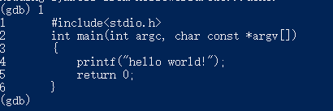
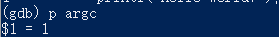
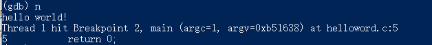
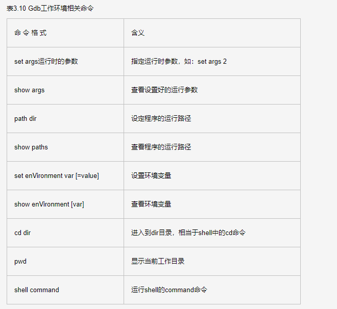
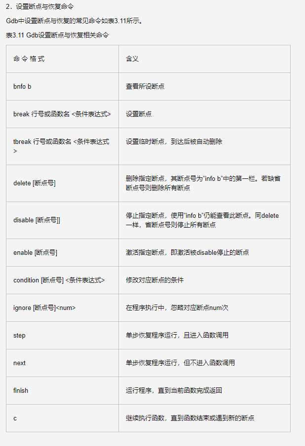

# Gcc编译流程

## 预处理

指令：gcc -E hello.c -o hello.i

## 编译

指令：gcc -S hello.i -o hello.s
生成的是汇编代码

## 汇编

指令：gcc -c hello.s -o hello.o
生成的是二进制文件

## 链接

静态库：静态库是指编译链接时，把库文件的代码全部加入到可执行文件中，因此生成的文件比较大，但在运行时也就不再需要库文件了。（Linux下后缀为“.a”， windows下后缀为“.lib”）
动态库：在编译链接时并没有把库文件的代码加入到可执行文件中，而是在程序执行时由运行时链接文件加载库，这样可以节省系统的开销。（Linux下后缀为“.so”， windows下后缀为“.dll”）

## 其他常用指令

1. -g 在可执行程序中包含调试信息

2. -I dir 在头文件的搜索路径中添加dir目录

3. -L dir 在库文件的收缩路径中添加dir目录

4. -static 链接静态库

5. -llibrary 链接名为library的库文件（由于在Linux下的库文件命名时有一个规定：必须以lib三个字母开头。因此在用-l选项指定链接的库文件名时可以省去lib三个字母。也就是说Gcc在对”-lsunq”进行处理时，会自动去链接名为libsunq.so的文件。）

## gdb

gdb只能调试可执行程序，在使用gcc生成可执行程序时要加上“-g”

1. -l 查看载入的文件

可以看出用“-l”显示代码会有行号的标记

2. b number 在number行设置断点

3. info b 查看断点情况

4. r 运行代码

可以看到运行到第一个断点（第4行停下）

5. p + 变量名 查看变量的值

"$N"只是一个引用标记

6. n 步过（step next） s 步入（step in）

7. c 程序继续执行

8. 其他指令

