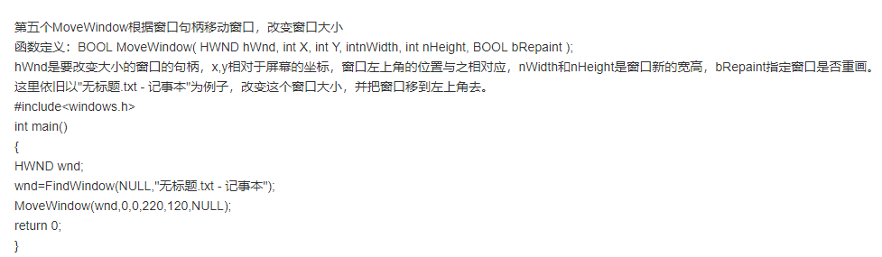
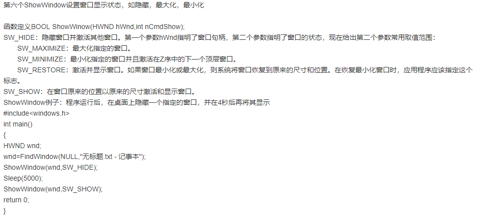
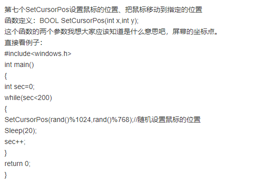
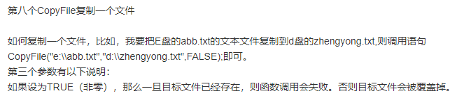
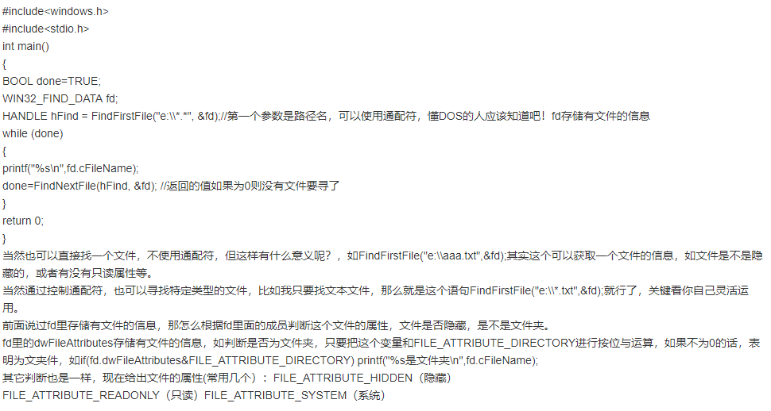
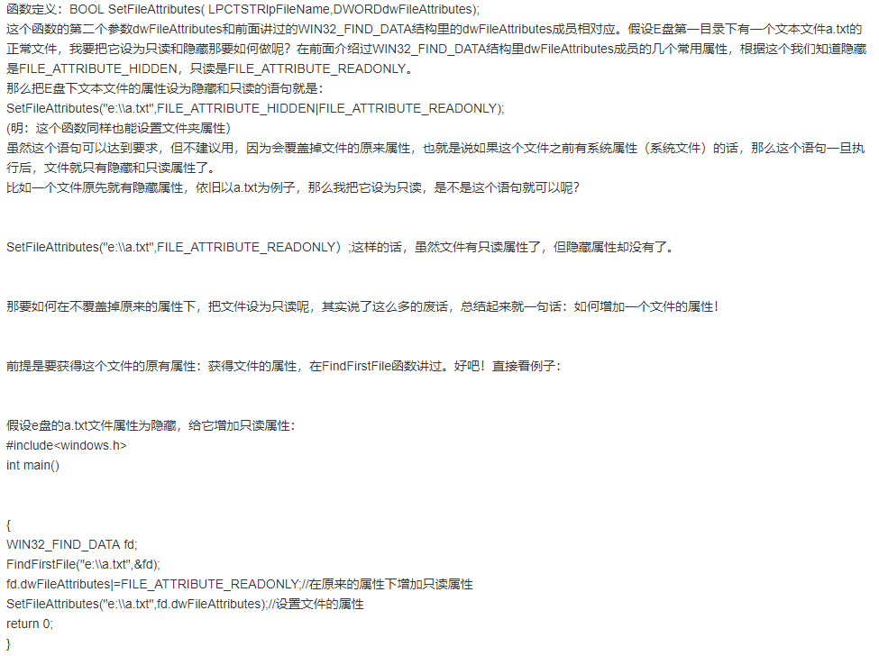
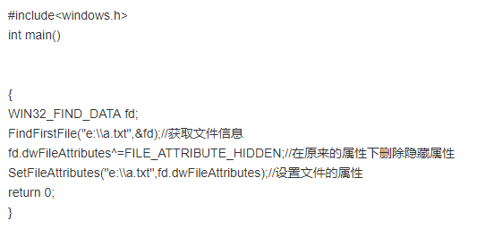
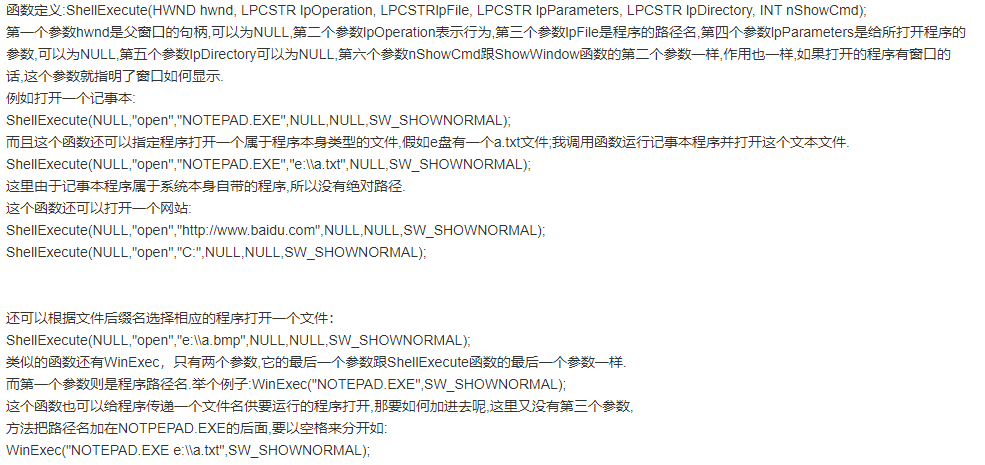

# 常用API

## GetCursorPos WindowFromPoint
```
#include<windows.h>
/*
 * POINT 可存储坐标点的结构体
 * GetCursorPos(&curpos) 获取当前鼠标的位置
 * WindowFromPoint(curpos) 根据鼠标所指的位置获得窗口的句柄
 * Sendmessage(hWnd, WM_CHAR, 'g', 0) 向当前窗口发送一个字符的消息
 */
int main(int argc, char const *argv[])
{
    
    POINT curpos;
    while(1) {
        GetCursorPos(&curpos);
        HWND hWnd = WindowFromPoint(curpos);
        SendMessage(hWnd, WM_CHAR, 'g', 0);
        Sleep(300);
    }
    return 0;
}
```

## MoveWindow



## ShowWindow



## SetCursorPos



## CopyFile

在Copy，Delete文件时要关闭文件




## DeleteFile


## CreateDirectory


## FindFirstFile FindNextFile



## MoveFile


## SetFileAttributes 谁之文件属性

添加一个属性



删除一个属性



## ShellExecute WinExec



使用QQ浏览器打开一个网站

```
ShellExecute(NULL, "open", "D:\\QQbrowser\\QQBrowser\\QQBrowser.exe", "https://www.baidu.com/?tn=98010089_dg&ch=15", NULL, SW_SHOWNORMAL);

```

## CreateToolhelp32Snapshot Process32First Process32Next

拍摄进程快照，输出进程信息

```
void test30()
{
    PROCESSENTRY32 pe32;
    pe32.dwSize = sizeof(pe32);
    HANDLE hProcessSnap = CreateToolhelp32Snapshot(TH32CS_SNAPPROCESS, 0);
    BOOL bMore = Process32First(hProcessSnap, &pe32);
    while (bMore)
    {

        printf("thread name:%s\n", pe32.szExeFile);     //szExeFile是进程名
        printf("thread ID:%u\n\n", pe32.th32ProcessID); //th32ProcessID是进程ID号

        bMore = Process32Next(hProcessSnap, &pe32); //寻找下个进程，函数返回0，则没有进程可寻
    }
}
```

