# WireShark过滤规则

## 过滤IP

1. ip.src eq 192.168.31.46 or ip.dst eq 106.2.69.93("eq"可以换成"=="下面的都一样)

过滤源ip地址为192.168.31.46或者目的ip地址为106.2.69.93的数据包

2. ip.addr eq 192.168.31.46

过滤源ip地址为192.168.31.46或者目的ip地址为192.168.31.46的数据包

## 过滤端口

1. tcp.port eq 80

过滤源端口或者目的端口为80的数据包

2. udp.port eq 80

3. tcp.dstport eq 80 or udp.port eq 80

4. tcp.port >= 1 and tcp.port <= 80

## 过滤协议

1. tcp(直接输入协议名称)

2. ！tcp(派出tcp协议)

## 过滤MAC

1. eth.dst == A0:00:00:04:C5:84

2. eth.src eq A0:00:00:04:C5:84

## 包长度过滤

## http模式过滤

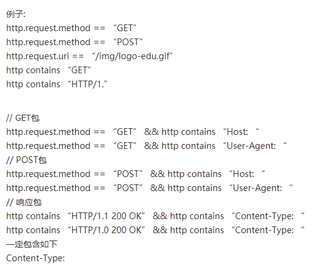

## TCP参数过滤

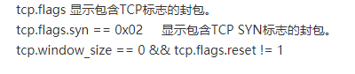

## 包内容过滤

##

# WireShark捕获数据包分析

## 物理层

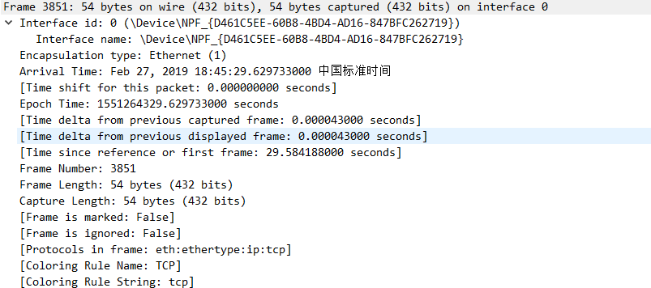

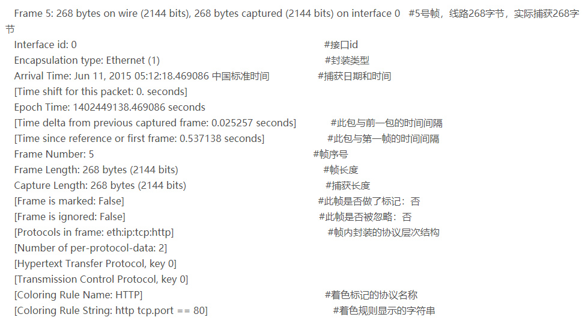

## 链路层

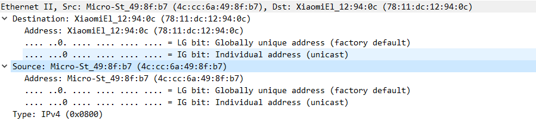

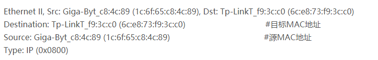

## 网络层

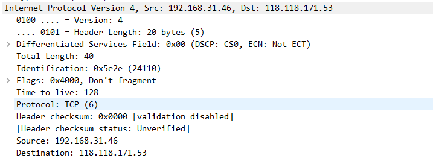

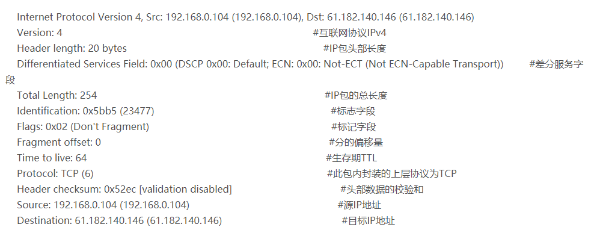

### IP数据报格式

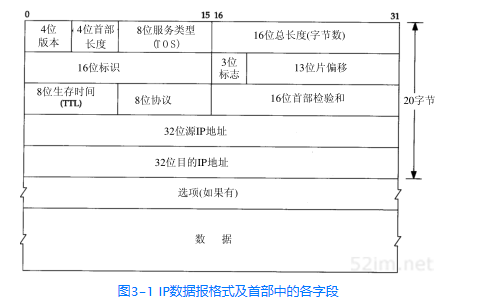

4位首部长度：是指IP首部占多少个32位， 由于IP首部一般时20字节所以是5

### 差分服务字段

## 运输层

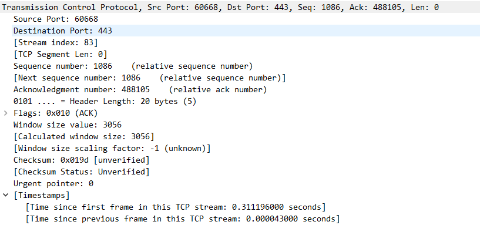

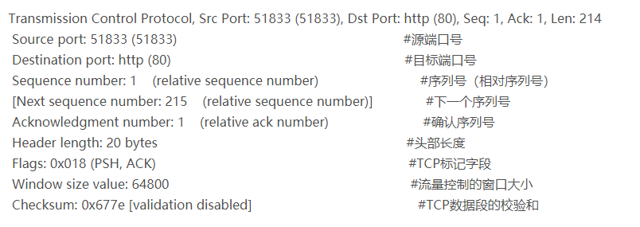

# TLS协议