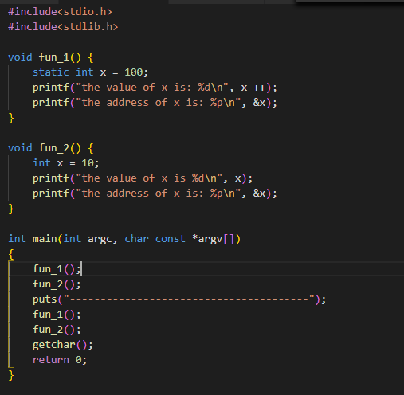
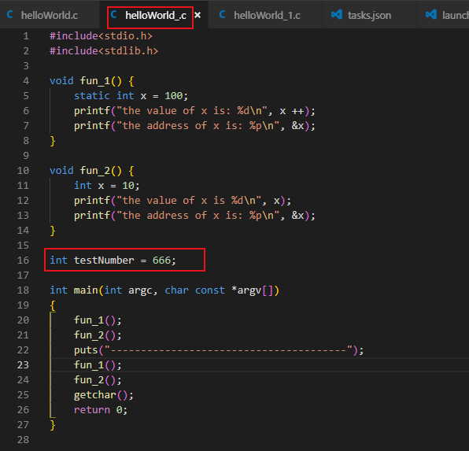
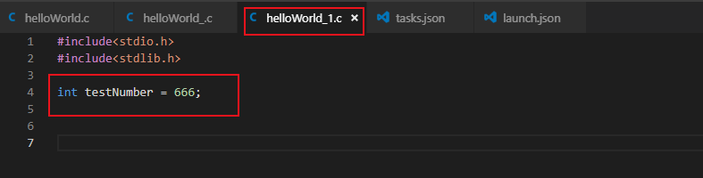
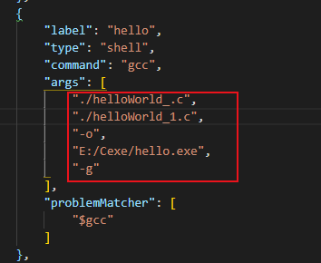
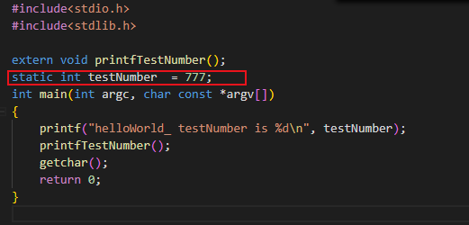
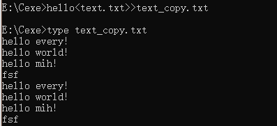

# 数据类型

## 内存管理

### 作用域

1. 块作用域

2. 函数作用域&&函数原型作用域

3. 文件作用域

### 链接

1. C变量有3种链接属性： 外部链接， 内部链接， 无链接

2. 块作用域， 函数作用域或函数原型作用域都是无链接的， 文件作用域可以是内部链接， 也可以是外部链接， 文件作用域变量前不加static时为外部链接， 否则为内部链接；

### 存储期

1. 静态存储期
    在程序执行期间一直存在， 所有文件作用域的变量具有静态存储期

2. 线程存储期
    从线程声明到线程结束一直存在， 以关键字_Thread_local声明一个对象时， 每个线程都获得该变量的私有备份；

3. 自动存储期
    块作用域的变量具有自动存储期， 从程序进入块到块末尾；

4. 动态分配存储期

### 存储类别(auto, register, static, extern, _Thread_local, typedef)

1. 自动： 块作用域， 无链接， 自动存储期

2. 寄存器： 块作用域， 无链接， 自动存储期

3. 静态外部链接： 文件作用域， 外部链接， 静态存储期， 只能初始化一次

4. 静态内部链接: 文件用域， 内部链接， 静态存储期， 块中变量声明前加static

5. 静态无链接

### static详解

1. 静态局部变量




2. 静态全局变量

首先在helloWorld_.c中声明一个变量int testNumber = 666, 在另一个文件helloWorld_1.c中也声明一个int testNumber = 666, 然后这两个文件一起编译；








结果分析：全局变量在整个工程中都是全局可见的， 如果在helloWorld_1.c中使用helloWorld_.c中的tesetNumber只需要声明成：“extern int testNumber”
下面代码举例说明如何在helloWorld_.c中使用helloWorld_1.c中声明的int testNumber变量与void printfTestNumber()方法：


如果想让一个重名的变量只在一个文件中起作用使用static 关键词，如下例子：





## int 

1. 显示十进制， 八进制， 十六进制， 使用%d, %o, %x, 显示进制前缀， 使用%#d, %#o, %#x;

2. 字符八进制， 十六进制表是： '\o', '\h';

## 字符串

1. 用双引号括起来的内容被视为指向该字符串存储位置的指针；

````
printf("%s, %p, %c", "We", "are", *"friends")
````
输出： We, 0x100000f61, f


## 类型转化

1. unsigned char, signed char, short -> int

2. 涉及两种类型的运算， 两个值斗鱼被分别转换成两种类型的更高级别

3. 在赋值表达语句中， 计算的最终结果会被转换成被赋值变量的类型

4. 当作为函数参数传递时， char和short被转换成Int, float被转换成double

5. 强制类型转换

# I/O && 文件

## 基础

1. 文件的结尾标记EOF， 定义在stdio.h文件中， 为-1；

2. 重定向输入输出流： 设test.exe是编译后的可执行文件， 在windows, unix中使用 test<file, 将输入流与file相连， test>file， 将输出流与file相连， 按下ctrl+z（windows）或者 ctrl+d(unix)结束输入；


将输入流定向为text.txt文件


将输入流定向为text.txt文件，将输出流定向为text_copy.txt文件，即实现文件的拷贝


将输入定位到一个文件的结尾，使用>>



## printf()函数

### 转换说明

1. %a 浮点数， 十六进制数和p记数法

2. %A 同%a

3. %c

4. %d

5. %e 浮点数， e记数法

6. %E 同%e

7. %g 根据值的不同， 自动选择%f和%e。 %e格式用于制数小于-4或者大于或等于精度时

8. %G 同%g

9. %o 无符号八进制

10. %p 指针

11. %s 字符串

12. %u 无符号十进制数

13. %x 无符号十六进制数

14. %X 同%x

15. %% 打印一个%

### 转换说明修饰符

1. h 和整型转换说明一起使用表示short int 或 unsigned short int类型的值， 示例： "%hu", "%hx", "%6.4hd"

2. hh 和整型转换说明一起使用， 表示signed char 或 unsigned char类型的值， 示例："%hhu", "%hhx", "%6.4hhd"

3. j 和整型转换说明一起使用 表示intmax_t 或 uintmax_t类型的值， 示例："%jd", "%8jx"

4. l 和整型转换说明一起使用， 表示long int 或 unsigned long int类型的值， 示例："%ld", "%8lu"

5. ll 和整型转换说明一起使用， 表示long long int 或 unsigned long long int类型的值， 示例： "%lld", "%llu"

6. L 和浮点转换说明一起使用， 表示long double类型的值， 示例："%Lf", "%10.4Le"

7. t 和整型转换说明一起使用， 表示ptrdiff_t类型的值。 ptrdiff_t是两个指针差值的类型， 示例： "%td", "%12ti"

8. z 和整型转换说明一起使用， 表示size_t类型的值， size_t示sizeof返回类型， 示例: "%zd", "%12zd"

## scanf()函数

### scanf()转换说明的修饰符

1. 数字 最大字段宽度， 输入达到最大字段宽度处， 或者第一次遇到空白字符时停止， 示例："%*d"

2. hh 把整数作为signed char 或 unsigned char类型读取， 示例："%hhd", "%hhu"

3. ll 把整数作为long long 或 unsigned long long类型读取， 示例: "%lld", "%llu"

4. h

5. l

6. L

## fscanf(FILE* file, char* format, char* str) && fprintf(FILE* file, char* format, char* buf)

fscanf()与fprintf()都是以字符方式处理数据， 比方说fprintf(file, "%f", 1/3), 1/3转化成float为0.333333，存在file中就是8个字节

```
	FILE* srcFile = fopen("E:\\Cexe\\text.txt", "rw");
	char* str = (char* )malloc(100 * sizeof(char));
	while(!feof(srcFile)){
		if(fscanf(srcFile, "%s", str) != -1) {
			puts(str);
		} else {
			puts("error!");
		}
	}
	fclose(srcFile);
```

text.txt中的内容


运行结果


结果分析：fscanf()跟scanf一样作为带缓冲的输入会忽略掉空格与回车等特殊字符最后一个字符时EOF所以会有一个"error"的打印

## puts()

```
char* str = "hello world!";
puts(str);
```

只显示字符串， 并且自动在显示的字符串末尾加上换行符；

## getc() && putc()

函数原型 int getc(FILE* file); int putc(char* c, FILE* file)

```
char inputchar;
	FILE* srcFile = fopen("E:\\Cexe\\text.txt", "rw");
	FILE* dstFile = fopen("E:\\Cexe\\text_copy.txt", "a+");
	
	while((inputchar = getc(srcFile)) != EOF){
		int result = putc(inputchar, dstFile);
		printf("%c", result);
	}
	fclose(srcFile);
	fclose(dstFile);
```

文件操作权限：


## gets()

```
char* str = (char* )malloc(BUFF_SIZE * sizeof(char));
gets(str);
```

gets()会将输入的最后一个回车符从缓冲区丢掉

## fputs()

函数原型： int fputs(const char* str, FILE* stream)

str为要输出的字符串， stream为指定的输出流

```
//
char* str = "hello world!";
fputs(str, stdout);
```

不会自动加上换行符；

## fgets()

函数原型 char* fgets(char* str, int size, FILE* stream)

str为存储输入字符串的首地址， int为从stream中读取的字节数， stream为输入流， 返回输入字符串的首地址

## fseek() && ftell()

函数原型 int fseek(FILE* file, long offsit, long model)

model选定当前位置：


返回结果：0表示无错误， -1表示出错

函数原型 long ftell(FILE* file)

返回结果：文件当前位置距离开始的字节数

## fread() && fwrite()

fread()与fwrite()都是以二进制方式处理数据

fwrite函数原型: size_t fwrite(const void* restrict ptr, size_t size, size_t nmeb, FILE* resetrict fp)

ptr：要输出的数据首地址

size: 每个数据块的大小

nmenb: 输出多少个数据块

fp: 文件指针

返回：成功输出的数据块数量，没有出错的情况下等于nmeb

# 指针

http://www.doc88.com/p-907976424060.html