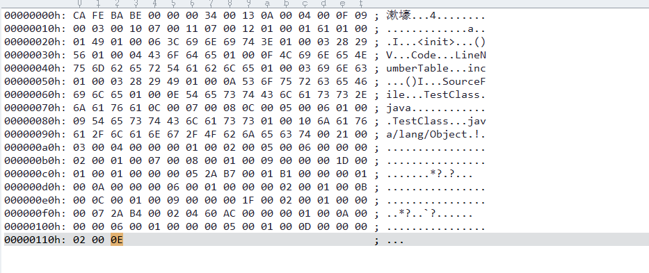
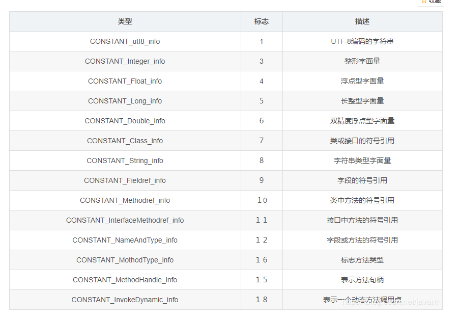
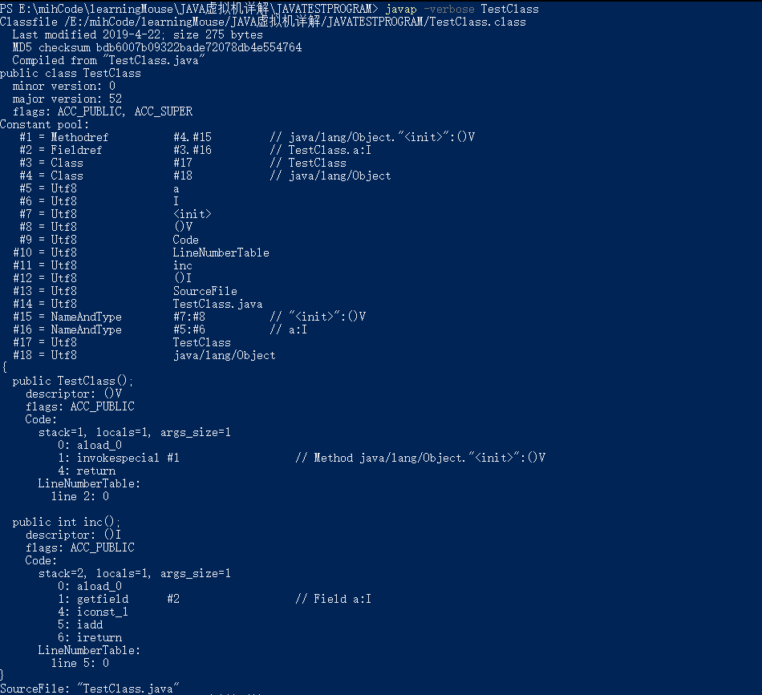

# 运行时数据区域

## 程序计数器

* 用来指示下一行字节码的行号

* 线程私有

* 对于native修饰的方法此区域为空

* 没有定义任何OutMemoryError

## 虚拟机栈

* 执行java字节码

* 线程私有， 声明周期和线程相同

* 每个方法在执行时都会创建一个栈帧， 包含局部变量表， 操作数栈， 动态链接， 方法出口等信息

* 栈深大于虚拟机允许深度抛出 StackOverflowError, 超过了虚拟机可扩展的最大内存抛出OutOfMemoryError异常

## 本地方法栈

* 执行native方法

* 同样会抛出StackOverflowError, OutOfMemoryError异常

## Java堆

* 所有线程共享

* 虚拟机启动时创建， 存放对象实例、数组（但不是绝对的）， GC管理的主要区域(又可分为新生代，老年代)

* 会抛出OutOfMemoryError异常

## 方法区

* 线程共享

* 存储已被加载的类信息（Class的相关信息）， 常量， 静态变量等

* 几乎不需要GC管理（有些虚拟机把这不会归到了永久代）

* 会抛出OutOfMemoryError异常

## 运行时常量池

* 方法区的一部分

* 存放编译期间生成的各种字面量和符号引用

* 会抛出OutOfMemoryError异常

## 直接内存

* 不属于JAVA运行时数据区， 比如JAVA NIO可以在堆外分配内存， 然后通过JAVA堆中的一个引用对堆外内存进行操作

* 会抛出OutOfMemoryError异常

# JAVA对象的创建

1. 首先在常量池中检查有没有已经存在这个对象所属类的引用， 如果没有就先加载类

2. 分配内存

3. 对对象进行必要的设置

# JAVA对象的内存布局

1. 对象头（header）

* 自身运行时的数据

* 类型指针

2. 实例数据， 真正存储有效信息大的部分

3. 对齐填充， 用于内存对齐

# java中的引用

* 强引用

* 软引用

* 弱引用

* 虚引用

# JAVA垃圾回收算法

1. 标记-清除算法

* 效率不高

* 会产生大量不连续的碎片， 需要进行碎片收集

2. 复制算法

思路：将GC管理的内存分为两份， 每次分配内存只是用其中一份， 使用的那一份内存满了后将其中存活的对象复制到另一份， 清除原来那分内存中的所有对象数据， 继续使用新的那一份内存；

实际应用：JAVA 堆中新生代的回收是最频繁的， 并且这段内存中绝大部分对象是要被回收的， 所以不需要按照1：1将内存平分， 可以将这部分内存的80%用作eden空间， 10%的用作survivor空间， 10%的用作eden、survivor中存活对象的拷贝空间；

3. 标记整理算法

与标记-清除算法相比多了整理的步骤， 在标记完要清除的对象后不是直接删除， 而是将存活的对象向一端移动， 之后直接清除另一端到内存结尾的所有对象；

4. 分代收集算法

就是将JAVA堆分为新生代和老年代， 新生代使用复制算法， 老年代使用标记-清除或者标记整理算法；

# Class 字节码文件

测试代码：

二进制字节码：

1. 头4个字节（CA FE BA BE）称表明这个文件是不是可以被虚拟机接受的class文件;

2. 第5，第6个字节是次版本号， 第7， 第8个字节是主版本号

3. 第9， 第10个字节， 偏移量为0x00000008, 表示常量池容量

这里有0x13个常量， 即19个常量， 但是常量计数是从1开始的， 0作为保留常量， 常量包括字面量和符号引用， 其中符号引用包括类或接口的全限定名称， 字段的名称和描述符， 方法的名称和描述符；

常量池中每一项都是一个表， 每个表的内容都不尽相同（除了第一项， 在下面常量表的描述中u1表示1个字节， u2表示2个字节， u4表示4个字节），  

4. 常量池内容：

0A表示类中方法的符号引用， 该表项结构：

* CONSTANT_Methodref_info

{
    tag u1;(0x0000000a)
    index u2; //指向声明方法的类描述符CONSTANT_Class_info的索引项（0x0000000b）
    index u2; //指向名称及类型描述符CONSTANT_NameAndType的索引项
    (0x0000000d)
}

* CONSTANT_Fieldref_info

{
    tag u1(0x0000000f);
    index u2; //指向声明字段的类或者接口描述符CONSTANT_CLASS_INFO的索引项(0x00000010)
    index u2; //指向字段描述符CONSTAANT_NAMEANDTYPE的索引项
    (0x00000012)
}

* CONSTANT_Class_info

{
    tag u1(0x00000014);
    index u2; //指向全限定名常量项的索引(0x00000015)
}

0x00000018: u2

* CONSTANT_utf8_info

{
    tag u1;
    length u2;utf-8编码的字符串占用的字节数(0x0000001b)
    bytes u1;长度为length的UTF-8编码的字符串(0x0000001d)
}

0x0000001e:tag u1

0x0000001b:length u2

0x0000001d:bytes u1

0x0000001e:tag u1

0x0000001f:length u2

0x00000021:bytes u1

0x00000022:tag u1

0x00000023:length u2

0x00000025:bytes u6

0x0000002b:tag u1

0x0000002c:length u2

0x0000002e:bytes u3

0x00000031:tag u1

0x00000032:length u2

0x00000034:bytes u4

0x00000038:tag u1

0x00000039:length u2

0x0000003b:bytes uf

0x0000004a:tag u1

0x0000004b:length u2

0x0000004d:bytes u3

0x00000050:tag u1

0x00000051:length u2

0x00000053:bytes u3

0x00000056:tag u1

0x00000057:length u2

0x00000059:bytes ua

0x00000063:tag u1

0x00000064:length u2

0x00000066:bytes ue

* CONSTANT_NameAndType_info 

{
    tag u1;(0x00000074)
    index u2; //指向该字段或方法名称常量项的索引(0x00000075)
    index u2; //指向该字段或描述符常量项的索引(0x00000077)
}

0x00000079:tag u1

0x0000007a:index u2

0x0000007c:index u2

* CONSTANT_utf8_info

0x0000007e:tag u1

0x0000007f:index u2

0x00000081:index u9

0x0000008a:tag u1

0x0000008b:index u16

0x0000008d:index u9

使用javap -verbose ClassFileName可查看常量池内容：

5. 访问标志， 包括这个Class是类还是接口， 是否定义为public类型， 是否定义为abstract类型， 是否声明为final等

0x0001 ACC_PUBLIC 是否为public类型

0x0010 ACC_FINAL 是否声明final

0X0020 ACC_SUPER JDK1.0.2之后编译出来的类必须为真

0x0200 ACC_INTERFACE 是否是一个接口

0X0400 ACC_ABSTRACT 是否是abstract

0X1000 ACC_SYNTHETIC 表明这个类并非由用户代码产生

0X2000 ACC_ANNOTATION 是否是一个annotation

0X4000 ACC_ENUM 是否是一个枚举

这里偏离地址为0x0000009d, 占u2， 为00 21

6. 类索引、父类索引、接口索引集合

紧接着为类索引：
偏移量： 0x0000009f u2 内容为00 03, 表示常量池中索引值为3的常量， 由图P4可以看出为TestClass

紧接着为父类索引：
偏移量：0x00000a1 u2 内容为00 04， 由图P4可以看出为java/lang/Object

紧接着为接口索引集合：
首先用两个字节表示由多少个接口， 然后在这个两个字节之后是常量池中的接口名称；
偏移量：0x000000a3 u2 内容为00 00， 所以没有接口；

7. 字段表集合

字段包括类字段(static修饰), 实例字段， 不包括方法中的局部字段

* 字段表结构：

容量计数器， 表示这个类有多少字段

fields_count u2 偏移量为0x000000a5， 内容为：00 01, 表示只有一个字段；

* 访问标记：

ACC_PUBLIC 0X0001

ACC_PRIVATE 0X0002

ACC_PROTECTED 0X0004

ACC_STATIC 0X0008

ACC_FINAL 0X0010

ACC_VOLATILE 0X0040

ACC_TRANSIENT 0X0080

ACC_SYNTHETIC 0X1000

ACC_ENUM 0X4000

access_flags u2 偏移量为0x000000a7， 内容为:00 02, 所以这个字段修饰符为private

* 字段名称

指向常量池中的一个索引

name_index u2 偏移量为0x000000a9， 内容为:00 05, 由p4图的此字段名称为“a”

* 字段描述符

表示此字段是哪种数据类型

标识字符：B，含义： byte;

标识字符：J，含义： long;

标识字符：C，含义： char;

标识字符：S，含义： short;

标识字符：D，含义： double;

标识字符：Z，含义： boolean;

标识字符：F，含义： float;

标识字符：V，含义： void;

标识字符：I，含义： int;

标识字符：L，含义： 一个对象;

对于数组， 每一维开始都是“[”

descriptor_index u2 偏移量为0x000000ab, 内容为：00 06， 由p4图得为I, 表示int;

* 属性计数器

attributes_count u2 偏移量0x000000ad, 内容为: 00 00， 所以没有属性表

* attribute_info

额外属性名称索引， 指向常量池中的一个常量

8. 方法表集合

如果子类没有使用@Override对父类得方法进行重载， 则父类方法不会出现在子类的Class文件中；

* 方法计数器

偏移量为0x000000af, 内容为:00 02， 由两个方法

* access_flags

ACC_PUBLIC 0x0001 

ACC_PRIVATE 0x0002

ACC_PROTECTED 0X0004

ACC_STATIC 0X0008

ACC_FINAL 0X0010

ACC_SYNCHRONIZED 0X0020 是否为synchronied

ACC_BRIDGE 0x0040 是否由编译器产生的桥接方法

ACC_VARARGS 0x0080 是否接受不定参数

ACC_NATIVE 0x0100 native

ACC_ABSTRACT 0x0400

ACC_STRICTFP 0x0800 是否为strictfp

ACC_SYNTHETIC 0x1000 是否由编译器自动产生

偏移量0x000000b1, 内容改为00 01, 所以为public

* name_index

指向常量池中一个常量， 偏移量为0x000000b3, 内容为：00 07由图p4得内容为<init>

* descriptor_index

指向常量池中一个常量，偏移量为0x000000b5， 内容为：00 08由图p4得内容为()V

* 属性计数器

偏移量0x000000b7, 内容为00 01， 表示有一个额外的属性表

* attribute_info

偏移量0x000000b9， 内容为00 09， 由图p4得此额外属性为Code， 表示此属性是方法得字节码描述

9. 属性表集合

与Class文件中对数据项的数目、顺序进行严格的限制不同， 属性表的限制稍微宽松， 没有对属性表中属性的顺序进行限制， 同时每个人可以添加自己的属性实现自己的编译器；

每个属性的合法结构：

attrubute_name_index u2 指向常量池的一个索引

attribute_length u4 属性值的长度

info u(attribute_length)

虚拟机规范中预定义的属性：

* Code

属性表结构：

attribute_name_index u2 固定为"Code", 偏移量为0x000000b9;

attribute_length u4 偏移量为0x000000bb, 内容为00 00 00 1d, 属性值有29个字节；

max_stack u2 偏移量为0x000000c1, 表示这个方法的栈深， 偏移量为0x000000bf, 内容为00 01;

max_locals u2 偏移量为0x000000c3, 表示局部变量所占的存储空间， 这里计算存储空间时时按Slot计算的， 每4字节算一个Slot， 对于不满4字节的数据类型， 如byte， 同样分配一个Slot， 这里的局部变量包括， 方法参数， 异常处理的参数， this；

code_length u4 偏移量0x000000c3, 表示字节码指令长度， 这里为00 00 00 05 表示接下来5个字节都是字节码指令， 其中包括字节码指令中应有的参数

code 这里为： 2A B7 00 01 B1
attribute_

* ConstantValue

* Deprecated

* Exceptions

* EnclosingMethod

* InnerClass

* LineNumberTable

* LovalVariaTable

* StackMapTable

* Signature

* SourceFile

* SourceDebugExtension

* Synthetic

* LocalVariableTypeTable

* RuntimeVisibleAnnotations

* RuntimeInisibleAnnotations

* RuntimeVisibleParameterAnnotations

* RuntimeInvisibleParameterAnnotatins

* AnnotationDefault

* BootstrapMethods

