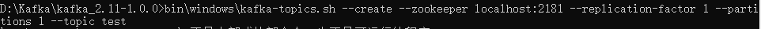
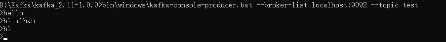
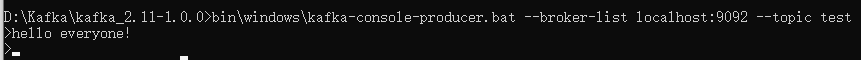
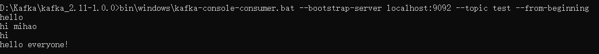
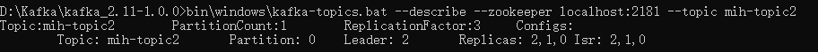
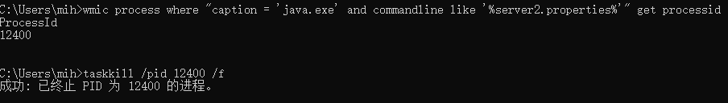
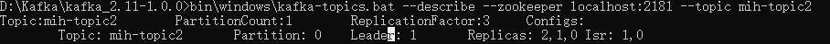

https://kafka.apachecn.org/

# Start

## 单机环境

1. 启动一个zookeeper的服务器， 在windows下使用命令：
```
bin\windows\zookeeper-server-start.bat config\zookeeper.properties
```


2. 启动kafka的服务器， 在windows下使用命令：

```
bin\windows\kafka-server-start.bat config\server.properties
```


3. 创建一个名为“test”的topic, 在windows下使用命令：

```
bin\windows\kafka-topics.sh --create --zookeeper localhost:2181 --replication-factor 1 --partitions 1 --topic test
```



4. 运行两个producer， 每个producer使用以下命令创建：

```
bin\windows\kafka-console-producer.bat --broker-list localhost:9092 --topic test
```

一个producer产生了3条消息：



一个producer产生了1条消息：



5. 运行两个consumer， 每个consumer使用以下命令创建：

```
bin\windows\kafka-console-consumer.bat --bootstrap-server localhost:9092 --topic test --from-beginning
```

每个consumer 都会收到相同的消息：



## 集群环境

1. 首先需要对kafka的启动配置文件进行复制和修改， 将config/server.properties文件复制得到config/server1.properties和config/server2.properties, 并对以下内容进行修改：

```
config/server1.properties:
    broker.id=1
    listeners=PLAINTEXT://:9093
    log.dir=/tmp/kafka-logs-1
 
config/server2.properties:
    broker.id=2
    listeners=PLAINTEXT://:9094
    log.dir=/tmp/kafka-logs-2
```

2. 启动两个kafka的服务器， 使用不同的配置文件：

```
bin\windows\kafka-server-start.bat config\server1.properties

bin\windows\kafka-server-start.bat config\server2.properties
```

3. 创建一个名为“mih-topic2”的topic：

这时我们有3个不同的kafka配置文件config/server.properties, config/server1.properties, config/server3.properties, 所以我们使用3个副本

```
bin\windows\kafka-topics.bat --create --zookeeper localhost:2181 --replication-factor 3 --partitions 1 --topic mih-topic2
```

4. 使用以下命令可以查看“mih-topic2”的相关信息：

```
bin\windows\kafka-topics.bat --describe --zookeeper localhost:2181 --topic mih-topic2
```

输出为：



其中“Leader”为集群的leader， 这个id为之前我们在启动kafka服务器时设置的broker.id; "Isr"为存活的正在同步的kafka服务器;

5. 我们将broker.id为2的leader进程停止， 使用以下命令：



这时们再看一下"mih-topic2"着topic的信息：



我们发现leader已经发生改变， 并且同步的kafka服务器也发生改变;

# kafka生产者


# kafka消费者

