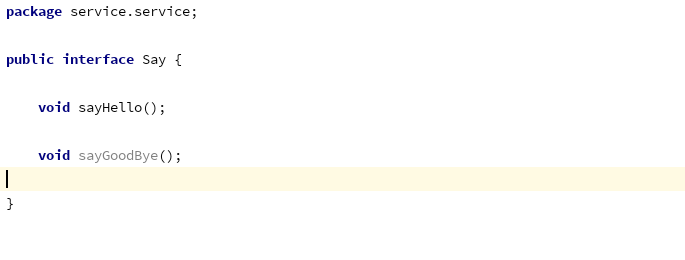

# Spring been装配

## 常用注解

* @EnableAutoConfiguration
会根据/META-INF/spring.factores中一个org.springframework.boot.autoconfigure.EnableAutoConfiguration作为key值扫描@Configuration
配置的bean

* @ComponentScan(basePackages = {"xxx", "xxx"...})

been组件的查找范围， 如果没有basePackages则默认在当前包中进行查找

* @Component(value = "xxx")

* @Autowired(request = "false")

此注解用于自动装配， 不仅仅用于装配成员引用变量， 同样可用于装配一些参数引用， 如：

此CompactDisc为一接口， @Autowired意为在Spring容器中找接口注入的实现；

```(java)
@Autowired
public CDPlayer(CompactDisc cd) {
        this.cd = cd;
}
```

* @Been

## 自动装配

### 使用@Component、@ComponentScan、@Autowired进行been注入

1. 首先定义一个接口


2. 实现这个接口


3. 在一个带有@Config注解的POJO上添加@ComponentScan注解


3. 在一个restful接口中测试been


补充：
1. @ComponentScan默认扫描的是同一个包下面的带有@Component等注解的POJO


## JAVA Config装配

使用@Been进行been注入

## XML显式装配

装配的Person对象如下：

```(java)
public class Person {
    public Person(String name, byte age, List<String> interests) {
        this.name = name;
        this.age = age;
        this. interests = interests;
    }
}

```

```(xml)

<?xml version="1.0" encoding="UTF-8"?>
<beans xmlns="http://www.springframework.org/schema/beans"
       xmlns:xsi="http://www.w3.org/2001/XMLSchema-instance"

       xsi:schemaLocation="http://www.springframework.org/schema/beans
                           http://www.springframework.org/schema/beans/spring-beans.xsd">


    <beans>
        <bean id="person" class="model.Person" ></bean>

        <bean id="mih" class="model.Person">
            <!--
            如果需要引用对象， 使用ref
            <constructor-arg>
                <ref bean="" /> 
            </constructor-arg>
            如果需要引用对象集合(list, set)，如下：
            <constructor-arg>
                <list>
                    <ref been = "" />
                    <ref been = "" />
                </list>
            </constructor-arg>
            <constructor-arg>
                <set>
                    <ref been = "" />
                    <ref been = "" />
                </set>
            </constructor-arg>
            -->
            <constructor-arg>
                <value>"mih"</value>
            </constructor-arg>
            <constructor-arg>
                <value>25</value>
            </constructor-arg>
            <constructor-arg>
                <list>
                    <value>"gaming"</value>
                    <value>"coding"</value>
                    <value>"sleeping"</value>
                </list>
            </constructor-arg>
            
        </bean>

    </beans>
</beans>

```