# 简单动态字符串(SDS)

```
struct sdshdr {
    // 当前字符串的长度
    int len;
    // buf数组剩余的成都
    int free;
    // 采用C语言的字符串的定义方式， 末尾有一个'/0'空字符
    char buf[]
}
```
buf的长度最少等于 len + free + 1;
使用上述数据结构定义字符串的好处：
1. 获取字符串长度时极高的速度;
2. 防止缓冲区溢出， 再进行字符串拼接时， 可以根据free判断剩余的空间是否能够放下另一个字符串， 如果不能进行扩容;
3. 可以对buf进行预分配， 在扩容时并不是只分配缺少的内存， 而是会进行过量的分配， 原则为： 如果重分配后buf的长度小于1MB， 则将原来的buf长度扩大为2倍， 如果重分配后buf的长度大于等于1MB则直接分配1MB;
4. 惰性空间释放， 在删除字符时， 并不会回收buf的空间空间， 而是free加上回收的字符长度， 这样下次进行字符拼接时， 就可能不用重新申请新的内存空间;

# 链表

redis种的链表使用双向链表，C语言定义为：

```(链表节点定义)
typedef struct listNode {
    // 前驱节点
    struct listNode *pre;
    // 后置节点
    struct listNode *next;
    // 值
    void *value;
}
```

```(链表定义)
typedef struct list {
    // 头节点
    listNode *head;
    // 尾节点
    listNode *tail;
    // 链表长度
    unsigned long len;
    // 链表的一些操作函数
    .......
}

```

# 字典

Redis的字典使用哈希表实现， 一个哈希表种可以有多个哈希表节点， 而每个哈希表节点就保存了字典中的一个键值对;
```(哈希表定义)
typedef struct dictht{
    // 指向哈希表节点的指针数组
    dictEntry **table;
    // 哈希表的大小， 即dictEntry指针数组的大小
    unsigned long size;
    // 哈希表大小掩码， 用于计算索引值
    // 总是等于size - 1
    unsigned long sizemask;
    // 该哈希表已有的节点数量
    unsigned long used;
}
```

```(哈希表节点定义)
typedef struct dictEntry {
    // 键
    void *key;
    // 值
    union {
        void *val;
        uint64 _tu64;
        int64 _ts64;
    }v;
    // 指向下一个哈希节点
    struct dictEntry *next;
}

```

```(redis中字典的定义)
typedef struct dict {
    // 指向一簇函数
    dictyType *type;
    // 函数的参数
    void *privdata;
    // 哈希表数组， 一般只使用ht[0]， ht[1]在rehash时使用;
    dictht ht[2];
    // 记录rehash的进度， 如果目前没有进行rehash则为-1;
    int trehashidx;
}

```

## rehash

当hash表保存的键值对比较多， 超过负载因子时， 需要进行rehash操作， 过程如下：
1. 计算ht[1]需要分配的空间， 如果为扩展操作， 分配大于等于ht[0].used * 2的2^n; 如果是收缩操作， 分配大于等于ht[0].used的2^2;
2. 重新计算键在ht[1]上的索引值;
3. 将ht[1]作为ht[0], ht[0]作为ht[1];
   
## 扩展与收缩发生的时机

负载因子 = 哈希表已经保存的节点数量 / 哈希表大小

发生扩展的时机：

1. 服务器没有进行BGSAVE或者BGREWRITEAOF, 并且哈希表的负载因子大于等于1;

2. 服务器正在进行BGSAVE或者BGREWRITEAOF, 并且哈希表的负载因为大于等于5;

redis使用MurmurHash算法计算键的hash值;

## 渐进式hash

1. 为ht[1]分配内存空间：
2. 将rehashidx置为0， 表示rehash正在进行;
3. 在rehash进行期间每次对hash表进行的添加、删除、查找或者更新操作都会顺带将ht[0]在rehashidx索引上的链表进行rehash, rehashidx索引上的链表rehash结束后将rehashidx加1;

在rehash期间redis会同时操作ht[0], ht[1]两个hash表， 对于添加的新的键值对， 会添加到ht[1]上;

# 整数集合

整数集合是redis用于保存整数值的集合抽象数据结构， 可以保存的类型为int16_t、int32_t、int64_t;

```
typedef struct intset {
    // 编码方式
    uint32_t encoding;
    // 集合包含的元素数量
    uint32_t length;
    // 保存元素的数组
    int8_t contents[];
}
```

虽然contents声明成int8_t但实际类型由encoding指定;

## 升级

由于contents的类型实际由encoding指定， 但是当插入的数据类型大于或小于实际类型的最大或最小值时， 整数集合会进行升级;
整数集合不支持降级;

# 压缩列表


# 对象

# 数据库

redis将所有的数据库都保存在redis.h结构的db数组中;

```
struct redisServer {
    // 一个数组， 保存着服务器中的所有数据库;
    redisDb *db;

    // 服务器的数据库数量
    int dbnum;
}
```
redisDB的数据结构：

```
typedef struct redisDb {
    // 数据库键空间， 保存着数据库所有的键值对;
    dict *dict;
    // 过期字典
    dict *expires;
}
```

## 读取键时的额外操作

1. 更新键空间命中次数和不命中次数;
2. 更新LRU(最后一次使用)时间;
3. 如果发现键已过期, 删除过期键;
4. 使用watch命令进行监视，在对该键进行修改后， 会将该键标识成"脏", 从而让事务注意到这个键;
5. 每次修改一个键会使脏键计数器增加1， 这个计数器会触发持久化及复制;

## 过期键删除策略

1. 定时删除： 设置键的过期时间的同时创建一个定时器， 在键过期时立即删除;
2. 惰性删除： 放任过期键不管， 只有在查询时， 如果发现键过期了才进行删除;
3. 定期删除： 每过一段时间就检查一次数据库中过期的键， 存在就进行删除;

## RDB对过期键的处理

* 在执行SAVE、BGSAVE进行RDB持久化时， 会忽略过期键
* 在Redis启动时， 如果启动了RDB功能， 如果以主服务器启动， 会忽略过期键， 如果以从服务器启动会将过期键与未过期键一起进行载入;

## AOF对过期键的处理

* 在写入AOF文件时， 发现键过期， 但是没有定期删除过着惰性删除时， 就会在AOF文件中添加一条DEL命令;
* 在进行AOF文件重写时， 发现键过期， 不会将键保存到重写的AOF文件中;

## 复制对过期键的处理

* 主服务器在删除一个过期键时会对从服务器发送通知， 告诉从服务器删除过期键；从服务器只有在收到主服务器发来的DEL命令时才会删除过期键；
* 从服务器执行客户端的命令， 即使碰到过期键也不会删除；

# RDB持久化

## RDB文件的创建

* SAVE: 会阻塞redis服务器进程， 直到RDB持久化完成;
* BGSAVE: 会创建一个子进程， redis服务器不会阻塞;

## RDB文件的载入

* 服务器在启动时发现有RDB文件存在就进行载入；
* 如果服务开启AOF持久化功能， 会优先使用AOF文件还原数据库的内容， 只有在AOF持久化功能处于关闭状态时才会使用RDB文件;

## BGSAVE执行时的服务器状态

* 客户端发送的SAVE命令会被拒绝;
* 客户端发送的BGSAVE命令会被拒绝;
* BGWRITEAOF和BGSAVE不能同时执行，BGSAVE执行时， BGWRITEAOF会被延迟到BGSAVE执行完成, BGWRITEAOF执行时BGSAVE命令会被拒绝;
  
## RDB文件结构

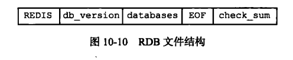

1. 开头REDIS长度为5字节， 保存“redis”5个字符， 为标志字符；
2. db_version 为RDB文件的版本号；
3. databases保存零个或多个数据库及其键值对数据；
4. EOF为一字节， 标志RDB文件结束；
5. check_sum为校验和；

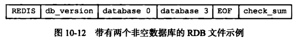

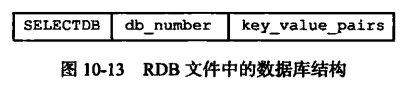

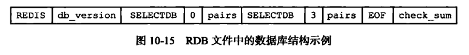

不带过期时间的key_value_pairs的数据结构为：


带过期时间的key_value_pairs的数据结构为：

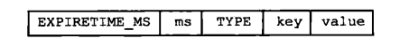

## value编码

1. 字符串对象

Type的值为“REDIS_RDB_TYPE_STRING”, 编码可以是“REDIS_ENCODING_INT”或者“REDIS_ENCODING_RAW”

如果编码是“REDIS_ENCODING_INT”会根据数字的大小使用不同的ENCODING：

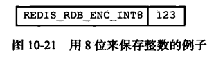

如果编码是“REDIS_ENCODING_RAW”会使用压缩与不压缩两种方式保存：

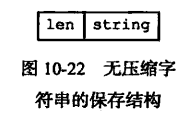

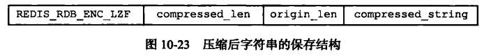

2. 列表对象

Type的值为“REDIS_RDB_TYPE_LIST”

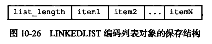

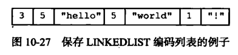

# AOF持久化

AOF持久化是通过保存Redis服务器所执行的写命令来记录数据库状态的;

AOP持久化功能的实现是通过命令追加、文件写入、文件同步三个步骤;

## 命令追加

在redis服务状态的数据结构中有一个aof_buf的缓冲区， 执行完一条命令后会将相应的内容追加到这个缓冲区的末尾;

```
struct redisServer{
    //...
    sds aof_buf;
    //...
}
```

## 文件写入与同步

Redis的服务进程是一个循环， 其流程如下:

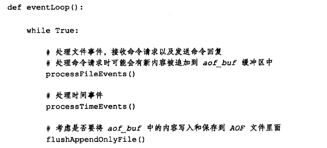

flushAppendOnlyFile()函数的行为由服务器配置的appendfsync选项的值确定， 不同值产生的行为如下：

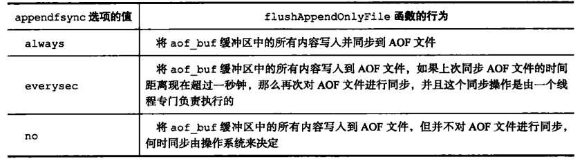

* 写入与同步的区别： 操作系统中执行write()等函数并不是直接将内容写入文件， 而是先写入一个缓冲区，在缓冲区填满或者超过一定时间之后执行一些同步操作， 将缓冲区的内容同步到文件中;

## AOF文件还原数据库

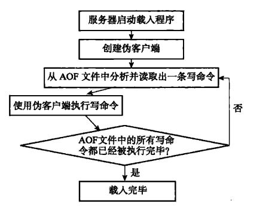

## AOF文件重写

随着客户端执行的命令越来越多， AOF文件会膨胀的越来越臃肿， 其中会包含很多冗余的命令， redis提供了文件重写功能， 通过redis重写可以创建一个新的AOF文件代替现有的AOF文件， 两个文件包含的数据库状态信息完全相同， 但新的AOF文件不包含任何冗余命令;

### AOF文件重写的实现

要去除所有的冗余指令， 最简单的方式不是去将AOF文件中保存的指令重新执行一边而是直接读取现在redis数据空中相应键对应的值， 然后直接使用一条指令完成数据的保存;

### AOF后台重写

AOF重写期间会重建一个新的子进行完成AOF重写， 但是如果在重写期间redis服务器又对数据库产生了一些修改， 那重写期间做的修改不就变得无效了吗？ 为了解决这个问题， redis重写时会创建一个重写缓冲区， 也就是如果重写期间服务器对数据库做出修改， 会将执行的指令同时保存到AOF缓冲区和AOF重写缓冲区， 在AOF重写子进程执行结束后， 会给Redis服务器发一个信号， 将AOF重写缓冲区的指令写入一个新的AOF文件， 将新的AOF文件改名覆盖原有的AOF文件;

# 事件

## 文件事件

* 使用I/O多路复用同时监听多个套接字， 并根据套接字目前执行的任务来为套接字关联不同的事件处理器；

* 当多个文件事件同时产生时， I/O多路复用程序会将多个事件放入一个队列中， 每次从队列中取出一个事件传送到事件分配器， 执行关联的事件处理器， 当事件处理器执行完毕后， 再从队列中去取下一个事件；


## 事件事件

### ServerCron函数

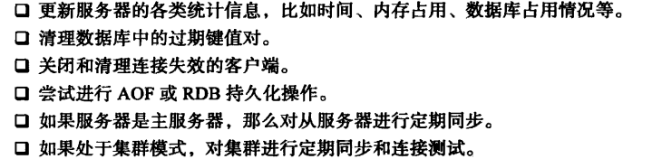

# 客户端

服务端状态保存了连接的客户端：
struct redisServer {
    // 客户端之间形成一个链表
    list *clients;
}

客户端数据结构：
typedef struct redisClinet {
    // 套接字描述符
    int fd;
    // 客户端的名字， 默认客户端没有名字
    robj *name;
    // 客户端当前的角色， 以及所处的状态
    int flags;
    // 输入缓冲
    sds querybuf

    robj **argv;
    int argc;

    struct redisCommand *cmd;
}

* fd: 为-1时表示客户端是一个伪客户端， 当服务器从AOF还原数据库， 执行Lua脚本时使用伪客户端； 不是-1时表示套接字描述符；


# 服务器

# 复制

可以通过SLAVEOF命令进行服务器的复制， 被复制的服务器称为主服务器（master）， 被复制的服务器称为从服务器（slave）;

## 旧版本复制功能的实现

Redis复制功能分为同步(syn)和命令传播(command prograte)两个操作:
同步操作用于将从服务器的状态更新至主服务器的状态；
命令传播操作用于当主服务修改后， 主从服务器状态不一致时， 重新使主从服务器回到相同的状态；

### 同步

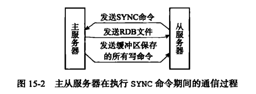

1. 从服务发送一个SYNC命令；
2. 主服务器收到SYNC命令后，执行BGSVAE命令， 在后台生成一个RDB文件， 并使用一个缓冲区记录从现在开始的所有的写操作；
3. 主服务器将RDB文件传送给从服务器， 从服务器接受这个RDB文件后将自己的数据库状态更新至主服务器执行BGSAVE时的状态；
4. 主服务器将缓冲区的写命令发送给从服务器， 使从服务器更新至主服务器当前的状态；

### 旧版本复制功能的缺陷

redis中主从复制可分为以下两种情况：
1. 初次复制： 从服务器没有复制过任何主服务器， 从服务器需要复制一个新的主服务器；

2. 断线后重新复制： 处于命令传播阶段的主从服务器发生了连接上的中断， 重连后继续复制主服务器；

存在的问题：
第一种主从复制的情况没有问题， 问题是第二种情况， 由于重连后需要重新发送SYNC命令， 会重新进行一次同步过程， 假设断线期间主服务器只进行了非常少量的数据修改， 但这时却需要重新进行同步， 会浪费大量的资源；

## 新版本的复制功能实现

使用PSYNC命令代替SYNC命令， PSYNC命令具备完整重同步和部分重同步两种模式

### 部分重同步的实现

部分重同步由以下三部分构成：

* 主服务器的复制偏移量和从服务器的复制偏移量；
  主服务器向从服务器传输多少字节的数据就在复制偏移量上加多少， 从服务器接受多少字节的数据就在复制偏移量上加多少；
* 主服务器的复制积压缓冲区；
  复制积压缓冲区是一个由主服务器维护的固定长度的先进先出的队列， 当主服务器进行命令传播时不仅会将命令传送给所有的从服务器， 同时还会将命令写入复制积压缓冲区， 同时会记录命令字符串中每个字节的偏移量， 如果从服务器的复制偏移量 + 1及之后的数据存在于主服务器的复制积压缓冲区中， 则执行部分重同步， 如果不在， 执行完整重同步；
* 服务器的运行ID；
  主从服务器启动时都会有自己的一个ID， 当从服务器初次对主服务器进行复制时， 会保存主服务器的运行时ID， 这样当从服务器断线并重新连接上一个主服务器时， 会向主服务器发送保存的主服务器ID， 如果ID相同， 那么主服务器尝试部分重同步， 如果不相同， 则进行完整重同步；

  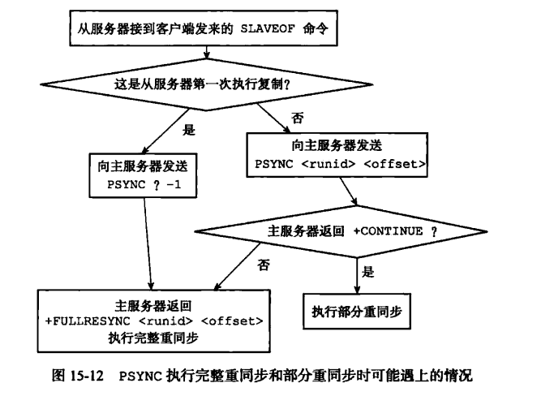

## 复制的实现

1. 设置主服务器的地址和端口
从服务器首先将客户端给定的主服务器的IP和端口保存到服务器状态的masterhost和masterport属性中
```
   struct redisServer {
       //...
       // 主服务器IP
       char *masterhost;
       // 主服务器端口
       int masterport;
       // ...
   }
```
2. 建立套接字连接
3. 发送一个PING命令
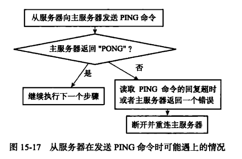
4. 身份验证
如果从服务器设置了masterauth选项， 则进行身份验证， 否则不进行身份验证， 验证的过程如下：
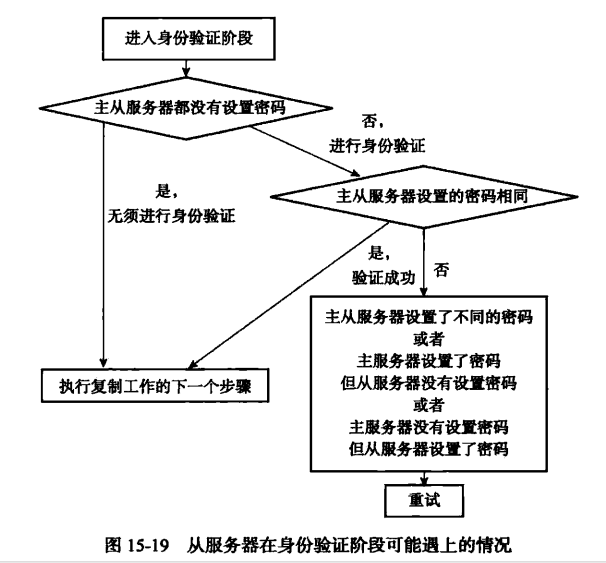
5. 发送端口信息
从服务器执行命令REPLCONF listening-port [port-number], 向主服务器发送从服务器的监听端口号，主服务器保存从服务器的监听端口号；
6. 同步， 从服务器向主服务器发送PSYNC命令， 执行同步操作， 将自己的从状态同步至主服务器的状态；
7. 命令传播；
## 心跳检测
在命令传播阶段，从服务器每过一秒回向从服务器发送命令：
REPLCONF ACK [replication_offset]
replication_offset是从服务器的复制偏移量；
* 检测主从服务器的连接状态；
* 辅助实现min-slaves选项；
* 检测命令丢失；

# Sentinel 哨兵
一个或者多个Sentinel组成Sentinel系统， 监视多个主服务器以及这些主服务器属下的所有从服务器， 并在主服务器下线时从下属的从服务器中选择新的主服务器

## 启动并初始化Sentinel

1. 初始化服务器；
Sentinel的本质就是一个执行在特殊模式下的Redis服务器;
2. 使用Sentinel专用代码；
3. 初始化Sentinel状态；
```
struct sentinelState{
    uint_64 current_epoch;
    // 保存了所有被监视的主服务器（或者其他Sentinel实例）
    // 键是主服务器的名字
    // 值是一个指向sentinelRedisInstance结构的指针
    dict *master;
    
    int tilt;

    int running_scripts;

    mstime_t tilt_start_time;

    mstime_t previous_time;

    list *scripts_queue;
}
```
4. 初始化master属性

```
typedef struct sentinelRedisInstance {

    int flags;

    char *name;

    char *runid;

    uint64_t config_epoch;

    sentinelAddr *addr;
    // 实例多少毫秒无响应后视为主观下线
    mstime_t down_after_period;
    // 这个实例客观下线所需的投票数
    int quorum;

    int parallel_syncs;

    mstime_t failover_timeout;

}
```

5. 创建连接主服务器的网络连接
Sentinel会创建两个连接主服务器的网络连接：
* 命令连接， 专门向主服务器发送命令；
* 订阅连接， 专门用于订阅主服务器的__sentinel__:hello频道；

## 获取主服务器的信息

Sentinel每10秒向主服务器发送一次INFO命令， 通过分析回复信息获取主服务器和从服务器的当前信息；

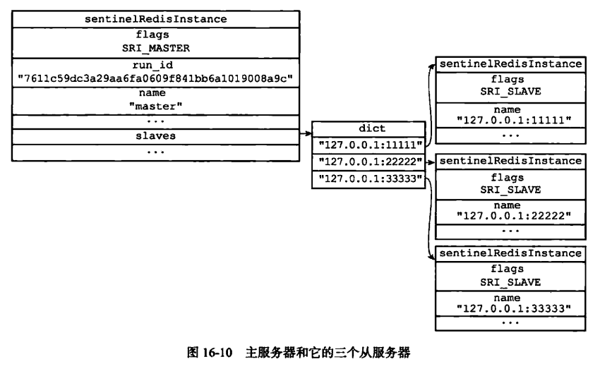

## 获取从服务器的信息

Sentinel会每10秒向从服务器发送INFO命令， Sentinel会获得以下信息：
* 从服务器运行的run_id;
* 角色role;
* 主服务器的IP地址及端口号；
* 主从服务器的连接状态；
* 从服务器的优先级；
* 从服务器的复制偏移量；

## 接收来自主服务器和从服务器的频道消息

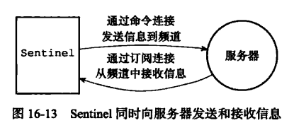

对于监视同一个服务器的多个Sentinel, 一个Sentinel发出的信息会被其他Sentinel接收到， 用于其他Sentinel更新对发送信息Sentinel的认知；

## 更新sentinels字典

Sentinel为主服务器创建的sentinels字典除了保存Sentinel本身之外， 还保存其他监视这个主服务器的Sentinel；

下图为主服务器保存的Sentinels字典结构

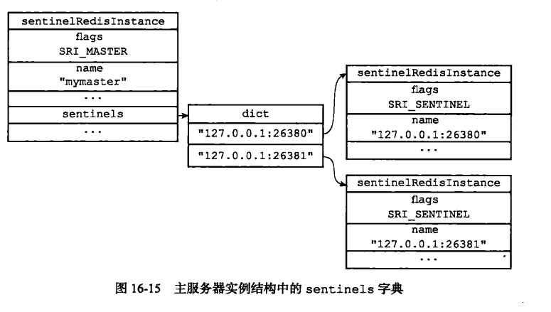  

当发现新的Sentinel， 不仅会在主服务器的Sentinels字典保存新的Sentinel， 其他所有的监视同一个主服务器的Sentinel会创建与新的Sentinel的命令连接， 这个新的Sentinel同样会创建于其他Sentinel的命令连接， 注意Sentinel之间不会创建订阅连接；

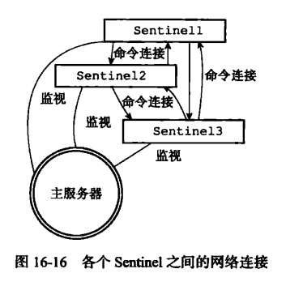  

## 检测主观下线状态

默认情况下， Sentinel会向与他创建了命令连接的所有实例（包括主服务器、从服务器、其他Sentinel）发送PING命令， 并通过回复判断实例是否在线；

* 有效回复： +PONG, -LOADING, -MASTERDOWN;
* 无效回复： 有效回复之外的回复；

Sentinel根据配置文件中的down-after-milliseconds指定Sentinel判断实例下线所需的最长时间， 如果在down-after-milliseconds内没有返回有效回复， Sentinel会修改这个实例对应的实例结构， 在flags属性中打开SRI_S_DOWN标志：

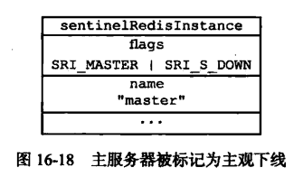

一个Sentinel设置的down-after-milliseconds会成为判断监视的所有主服务器， 主服务器下所有的从服务器， 其他监视相同主服务器的共同标准；

## 检查客观下线

当Sentinel将一个主服务器判定为主观下线后， 会询问其他监视这个主服务器的Sentinel， 当足够多的Sentinel同样判断这个主服务器下线时， Sentinel会将这个主服务器视为客观下线；

## 选举领头Sentinel

当一个主服务器被判定为客观下线时， 监视这个主服务器的Sentinel会选举出一个领头Sentinel对下线的主服务器进行故障转移；

首先每个Sentinel都会有机会成为领头Sentinel， 选举的过程简单来说就是每个Sentinel会向其他的Sentinel发送一条SENTINEL is-master-down-by-addr命令， 这个命令中会携带发送方的运行ID， 每个Sentinel会将自己接收的第一个
SENTINEL is-master-down-by-addr命令发送方选举为领头Sentinel， 并向发送方进行回复， 如果发送方接收到的回复中的runId和自己的相同， 表示接收方选举自己成为领头Sentinel， 当获得半数以上的选举后， 该Sentinel成为领头Sentinel;

## 故障转移

选举出的领头Sentinel对已下线的主服务器进行故障转移：

1. 在主服务器下的从服务器中挑选一个成为新的主服务器：

挑选一个状态良好、数据完整的从服务器然后向这个从服务器发送SLAVEOF no one 命令， 将这个从服务器转换为主服务器；

挑选的过程：

* 排除所有下线或者断线状态的从服务器；
* 排除所有5秒内没有回复领头Sentinel INFO命令的从服务器；
* 排除所有与下线主服务器断开连接超过down-after-milliseconds * 10毫秒的从服务器， 这可以保证从服务器的数据比较新；

之后对剩余的从服务器进行排序， 选择优先级最高的从服务器， 如果优先级相同， 选择复制偏移量最大的；

1. 其他的从服务器复制新的主服务器；
2. 旧的主服务器上线后成为新的主服务器的从服务器；

# 集群

集群中保存Redis服务器节点的数据结构：
```
struct clusterNode {
    // 节点创建的时间；
    mstime_t ctime;

    // 节点的名称， 由40个十六进制字符构成
    char name[REDIS_CLUSTER_NAMELEN];

    // 节点当前的状态及角色
    int flags;

    // 节点当前的配置纪元
    uint64_t configEpoch;

    // 节点的IP地址
    char ip[REDIS_IP_STR_LEN];

    // 节点的端口号
    int port;

    // 保存连接节点所需的有关信息
    clusterLink *link;
}
```

clusterLink的数据结构：

```
typedef struct clusterLink {
    // 连接创建时间
    mstime_t ctime;

    //TCP 套接字描述符
    int fd;

    // 输出缓冲区， 保存待发送给其他节点的消息
    sds sndbuf;

    // 输入缓冲区， 保存从其他节点接受的消息
    sds rcvbuf;

    // 与这个连接相关联的节点
    struct clusterNode *node;

}
```

每个节点保存着一个clusterState结构， 记录当前节点视角下集群的状态：
```
typedef struct clusterState {
    // 指向当前节点的指针
    clusterNode *myself;

    // 集群当前的配置纪元
    uint64_t currentEpoch;

    // 集群当前的状态
    int state;

    // 集群中至少处理着一个槽的节点数量
    int size;

    // 集群节点名单
    dict *nodes;
}
```

## CLUSTER MEET命令的实现

1. 节点A为节点B创建一个cluseterNode结构， 并将这个结构添加到clusterState.nodes字典中；
2. 根据cluster meet命令中给出的IP地址和端口号， 向目标节点B发送一条meet消息；
3. 收到A节点的meet消息后， B节点也会创建A节点的clusterNode结构， 并将其添加到自己的clusterState.nodes中；
4. 节点B回复节点A一条PONG消息；
5. 节点A收到节点B的PONG消息后回复节点B一条PING消息；
6. 如果节点B收到节点A的PING消息， 整个握手过程完成；

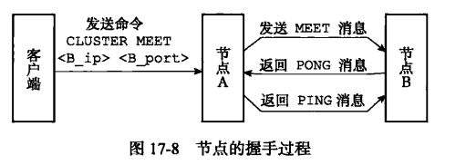

A与B握手完成后， A会通过Gossip协议让集群中其他的节点也与B进行握手；

## 槽位

集群的整个数据库被分成了16384个槽位， 集群中的每个节点可以处理这16384个槽位中的0到16384任意多个槽位， 当所有的槽位都被指派后， 集群完成上线， 否则集群处于下线状态；

节点的处理的槽位信息保存在clusterNode中:

```
struct clusterNode {
    // 类似bitMap, 每个字节中的每一位， 表示槽位是
    // 否被指派到该节点
    unsigned char slots[16384 / 8];
    int numslots;
}
```

集群中的每个节点都会通过消息通知集群中的其他节点自己处理的槽位信息；

clusterState中保存着每个槽位的指派信息：

```
typedef struct clusterState {
    // 每个指针指向一个节点， 表示该索引的槽位被指
    // 派给该节点
    clusterNode *slots[16384];
}
```

客户端向集群发出数据库相关指令的处理流程：

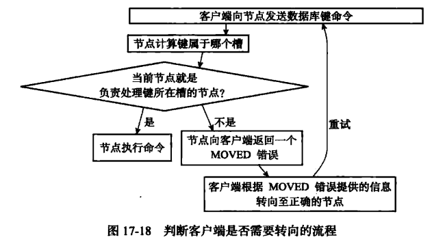

收到命令的节点首先会计算该槽位是否是自己处理的， 就看clusterState.slots[key] == clusterState.myself, 如果是自己处理的槽位执行相关的命令， 如果不是将命令指向clusterState.slots[key]指针指向的节点；

集群环境中每个节点保存键值对的方式和单机环境下完全相同， 不过集群环境下只能使用0号数据库；

集群环境下还使用调表保存着槽位号与键之间的关系：

```
typedef struct clusterState{
    // 调表排序依据槽位号
    zskiplist *slots_to_keys;
}
```

## 重新分片

将一个槽位从一个节点重新指派到另一个节点称为重新分片， 过程如下：
1. 向目标节点发送一条cluster setslot [slot] import [source_id]

```
typedef struct clusterState {
    // 数组响应位置的指针不为Null表示正在从相应的
    // 集群节点导入槽位
    clusterNode *import_slots_from[16384];
}
```

2. 向源节点发送一条cluster setsolt [slot] migrating [target_id]

```
typedef struct clusterState {
    // 数组响应位置的指针不为Null表示正在向相应的
    // 集群节点迁移槽位
    clusterNode *migrating_slots_to[16384];
}
```

3. 向源节点发送一条cluster getkeysinslot [slot] [count]， 获取count个属于slot的键值；
4. 向源节点发送一条migrate [target_ip] [target_port] [keyname] 0 [timeout] 将源节点的键值对原子的迁移到目标节点；
5. 重复3、4步直到所有的槽位迁移完成；
6. 向集群广播slot被迁移到了目标节点；

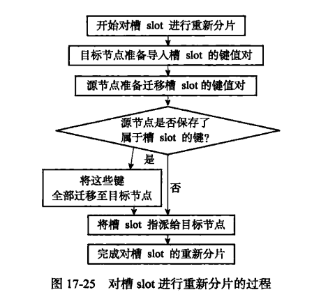

## ASK错误

假设一个键值对所在的槽位原本属于节点A， 但发生了重新分片并且重新分片过程没有完成， 这时又一条数据库操作命令发送到了A， 恰好操作的键值对被重新指派到了新的节点， 这是就会发生ASK错误；

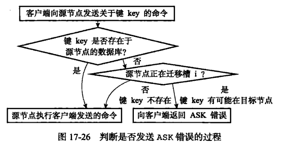

当客户端向一个集群节点发出数据库的查询指令是， 如果数据所在的槽位在该节点， 那么取该槽位寻找相应的键值， 如果找到执行相应的操作， 如果没有找到， 看migrating_slots_to[16384]， 如果发现该槽位正在迁移到其他节点， 返回一个ASK错误给客户端， 接着向目标节点发送一个ASKING命令：

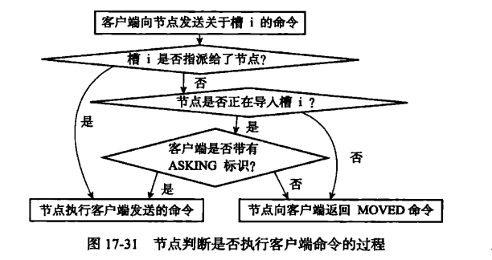

MOVED错误与ASK错误的区别：

MOVED错误产生的结果是长期的， 客户端在收到MOVED错误后， 之后对于该槽位的命令都会直接发送到MOVED错误指向的节点； ASK错误产生的结果是暂时的， 只会在收到ASK错误后接下来进行重新请求时向ASK错误指向的节点进行请求， 因为ASK错误是设置了客户端的ASKING标志位， 在执行了一次请求后ASKING标志位会被清除；

## 复制与故障转移

集群中主节点负责管理指派的槽位， 从节点负责复制主节点的槽位；

从节点保存主节点的结构：

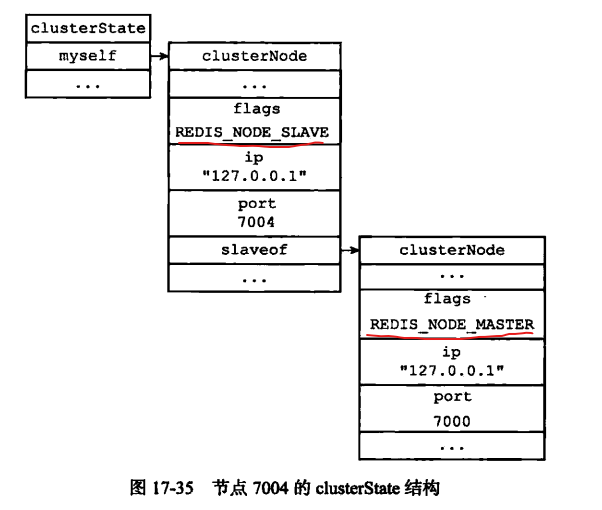

