# Mysql

## MySql理论

但是， MySQL最重要、 最与众不同的特性 是它的存储引擎架构， 这种架构的设计将查询处理（Query Processing）及其他系统任务（Server Task）和数据的存储/提取相分离。

### 事务的特征

1. 原子性（atomicity）
2. 一致性（consistency）
3. 隔离性（isolation）
4. 持久性（durability）

### 隔离级别

1. read UnCommitted（未提交读）
2. read Committed（提交读）
3. repeatable Read（可重复读）
4. serializable（可串行化）

## MySql 服务端对客户端请求的处理过程

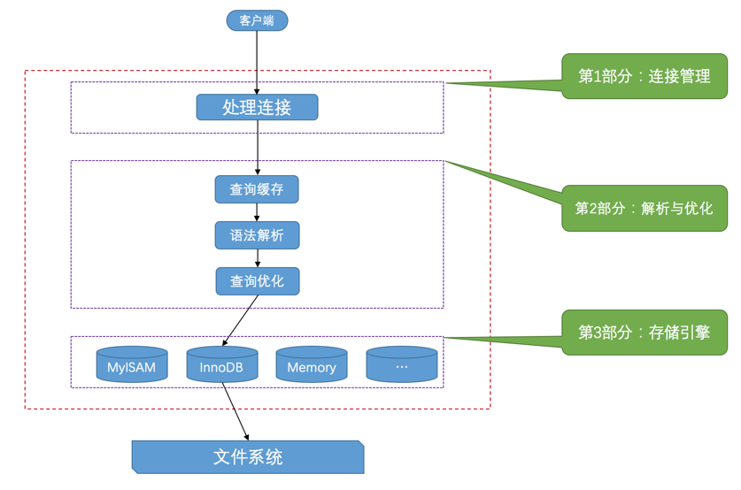

1. 连接管理主要负责服务端对连接线程的管理和对连接请求的验证， 如验证客户端的主机信息、用户名、密码等；
2. 解析与优化
   查询缓存即使用之前的查询结果，但由于要对缓存进行维护，MySql8.0中已经废弃了查询缓存；
   解析即一个类似编译的过程；
   优化即对我们的查询语句进行优化，结果是一个执行计划，可以使用EXPLAIN进行查看；
3. 存储引擎主要负责数据的存取工作，
   创建表时指定存储引擎：
   ```
    CREATE TABLE 表名(
    建表语句;
    ) ENGINE = 存储引擎名称;
   ```
   修改表的存储引擎：
   ```
    ALTER TABLE 表名 ENGINE = 存储引擎名称;
   ```

## InnoDB行格式

4中不同的行格式：Compact、Redundant、Dynamic和Compressed

## MySql索引的方法

1. FULLTEXT， 只有MyISAM引擎支持， 只有CHAR、VARCHAR ，TEXT列上可以创建全文索引
2. HASH， HASH索引可以一次定位，不需要像树形索引那样逐层查找,因此具有极高的效率。但是，这种高效是有条件的，即只在“=”和“in”条件下高效，对于范围查询、排序及组合索引仍然效率不高。
3. BTREE
4. RTREE， 支持该类型的存储引擎只有MyISAM、BDb、InnoDb、NDb、Archive几种
   
## 索引种类

1. 普通索引：仅加速查询
2. 唯一索引：加速查询 + 列值唯一（可以有null）
   ```
   create unique index index_name on table_name (column_name)

   ```
3. 主键索引：加速查询 + 列值唯一（不可以有null）+ 表中只有一个
4. 组合索引：多列值组成一个索引，专门用于组合搜索，其效率大于索引合并
5. 全文索引：对文本的内容进行分词，进行搜索

## MySql安装与配置（MySql-5.7.16）

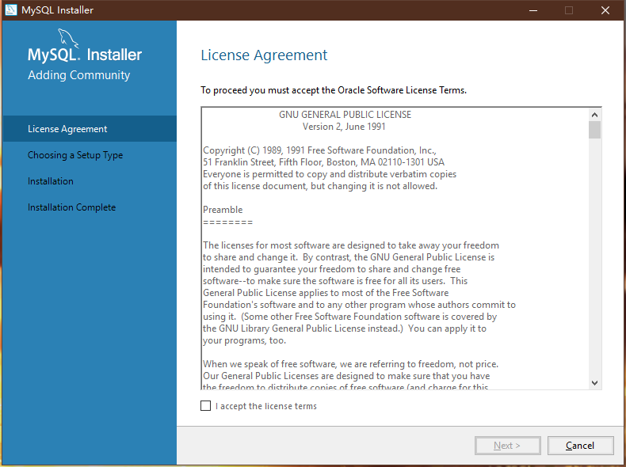

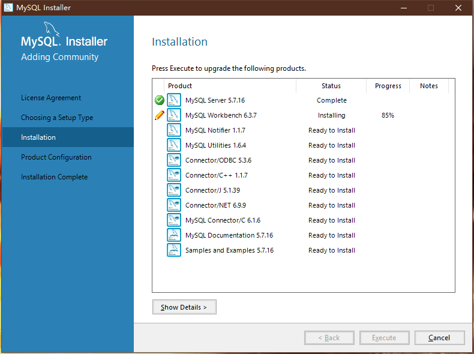

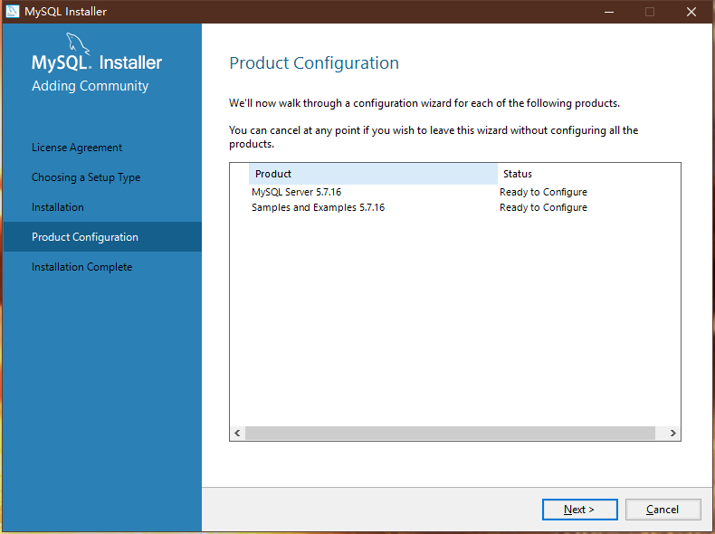

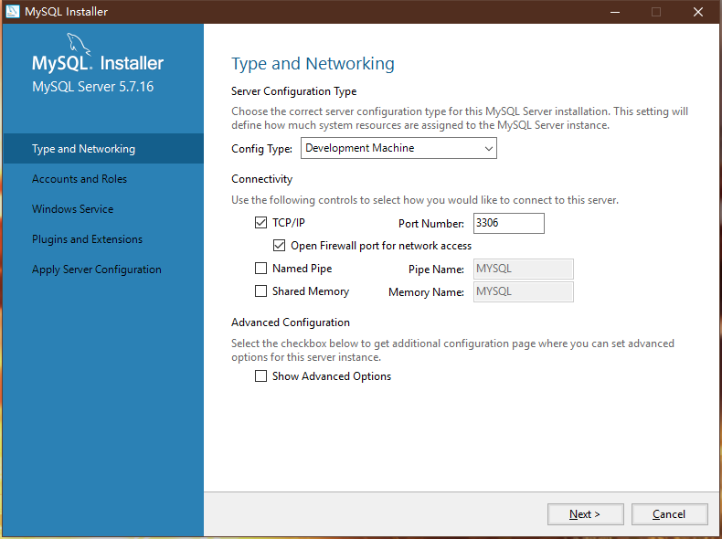

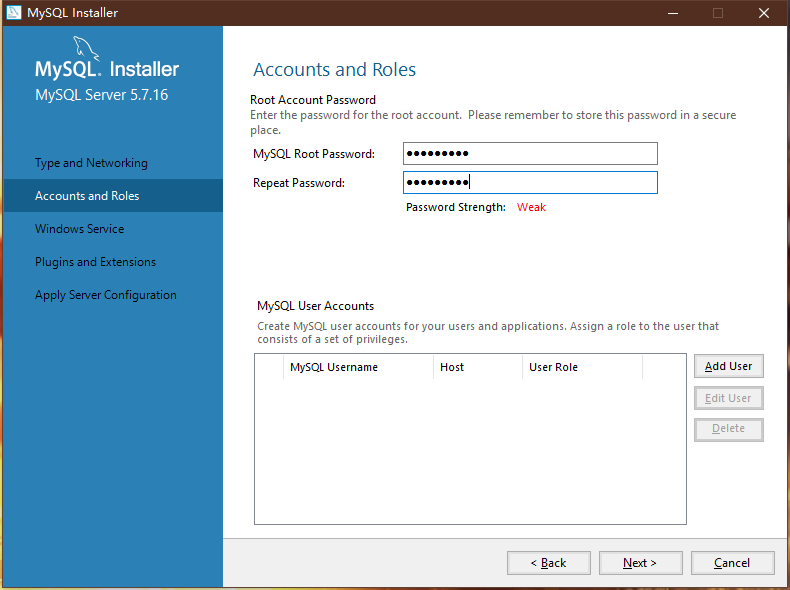

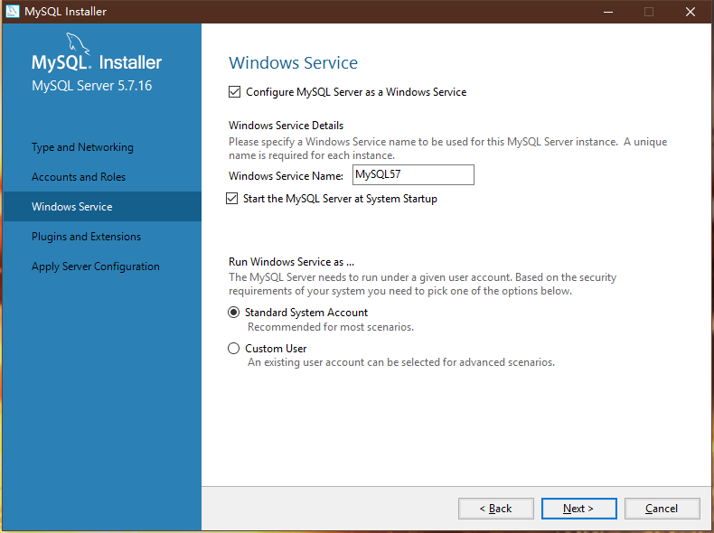

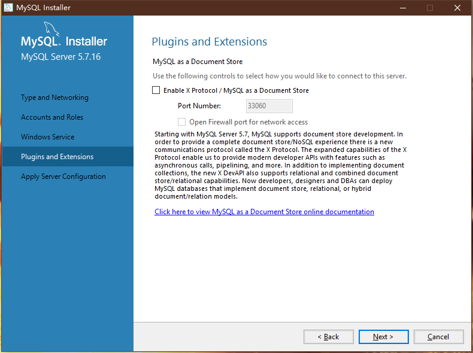

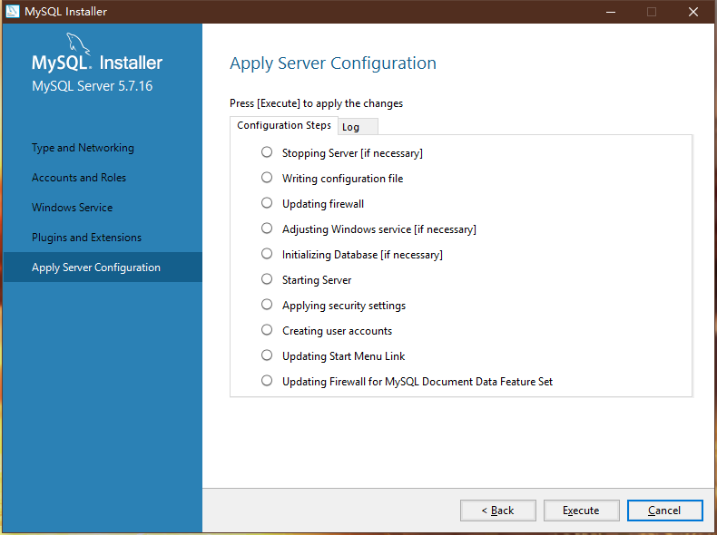


## 索引

http://www.cnblogs.com/hustcat/archive/2009/10/28/1591648.html

## Mysql数据库引擎

### 锁

#### 行级锁（row-loevel）

#### 表级锁（table-level）

#### 页级锁（page-level）

## MySql数据类型

1. varchar(n)

2. char

### varchar(5)与varchar(200)存储“hello”有什么区别？

首先char与varchar的区别在于除了一个定长，一个变长， varchar在存储时需要额外的字节保存最大的存储长度，如varchar(5)需要一个额外的字节（5 < 2^8 - 1），varchar(1000)需要两个额外的字节（2^8 < 5 < 2^16 -1）；
varchar(5)与varchar(200)在磁盘上存储同一个字符串是没有区别的，关键在于加入如内存时，比如排序或建立临时表，varchar(5)会申请5个字节的磁盘块，varchar(200)会申请200个字节的磁盘块。 

3. TEXT

4. BLOB

### TEXT与BLOB的比较？

对于BLOB和TEXT列的索引，必须指定索引前缀的长度。对于CHAR和VARCHAR，前缀长度是可选的;

Text被视为非二进制字符串, BLOB被视为二进制字符串, TEXT可视为为LONGVARCHAR， BLOB列视为能够足够大的VARBINARY列；

BLOB 可以储存图片,TEXT不行，TEXT只能储存纯文本文件；

5. DATETIME & TIMESTAMP

DATETIME:从1001到9999年， 精度是秒， 使用8个字节的存储空间

TIMESTAMP:从1970年1月1日开始的秒数， 精度是秒， 使用4个字节的存储空间

如何存储比秒更小粒度的时间呢？

6. BIT 

7. SET

## Mysql操作命令

1. 登录
````
mysql -h [host] -u[用户名] -p
````

2. 数据库启动指令 && 数据库退出指令

```
net start MySql57(数据库服务名称)
```

```
net stop MySql57
```

数据库服务名称在这里查找：

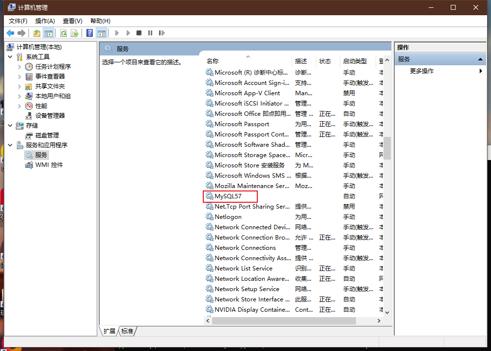


2. 退出
````
quit
````

3. 创建一个新的用户

````
create user '用户名'@'登录ip' indentified by '密码'
````
indentified by '密码'可以不加，表示登录不需要密码

@'ip'可用@'%'表示没有登录ip限制

4. 给用户授权

````
grant 权限 on 数据库名.表明 to 'test'@'%' 
````
被授权的用户无法对其他用户授权，如果想让被授权的用户能够对其他用户授权：

````
grant 权限 on 数据库名.表名 to 'test'@'%' with grant option
````

5. 查看用户权限

````
show grants for 'test'@'%';
````

6. 修改用户的权限

````
grant 权限 on 数据库名.表名 to 'test'@'%'
````

7. 修改用户密码

````
set password for 'test'@'%' = password('newpassword')
````

8. 撤销用户权限

````
revoke 权限 on *.* from 'test'@'%';
````

9. 删除用户

````
drop user 'test'@'%';
````

10. 载入数据

````
load data infile './pet.txt' int table pet fields terminated by ' ' lines terminated by '\r\n';
````

在执行这条指令的时候my.ini配置中的Secure File Priv 设置为：“secure-file-priv=”, secure-file-priv显示mysql载入数据与输出数据的路径，每次修改需要重启Mysql;
fields terminated by指定每行数据以什么字符分割；
lines terminated by指定每行数据以什么字符结尾；
./pet.text表示在Date文件下（默认数据路径）；
pet.txt中如果每行数据有空值用“\N”表示；

11. 更新数据

````
update pet set birth = '1989-08-31' where name = 'xx'
````

12. 条件查询

````
select * from pet where name = 'xx'

select * from pet where birth  >= 'xx'

select * from pet where species = 'xx' and sex = 'xx'

select * from pet where species = 'xx' or sex = 'xx'

select * from pet where (speciees = 'xx' and sex = 'xx') or (speciese = 'xx' and sex = 'xx')

select name, birth from pet

select name from pet (查出的数据可能有重复的)

select distinct name from pet (查出的数据没有重复的)

select name from pet order by birth desc (对查询出来的数据按照birth进行排序, 默认升序 desc 表示降序， asc 表示升序)

select name from pet order by birth, species desc (按照多个属性进行排序）

````

13. 多表查询

````
select a.id, a.name, a.address, a.date, b.math, b.english, b.chinese from table1 as a, table2 as b where a.id = b.id;

select id, name, pwd from table1 UNION uid, price, date from table2; (union 会删除重复行)

select id, name, pwd from table1 ALL uid price, date from table2; (ALL 不会删除重复行)
````

14. 分页查询

````
select * from table1 limit start, size;(start表示其实位置， size表示页大小， 起始位置从0算起)

select * from table1 limit size;
````

15. 关联多个数据表查询（join）

```
SELECT Persons.LastName, Persons.FirstName, Orders.OrderNo FROM Persons INNER JOIN Orders ON Persons.Id_P = Orders.Id_P ORDER BY Persons.LastName
```

不同的JOIN:

JOIN: 如果表中有至少一个匹配，则返回行
LEFT JOIN: 即使右表中没有匹配，也从左表返回所有的行
RIGHT JOIN: 即使左表中没有匹配，也从右表返回所有的行
FULL JOIN: 只要其中一个表中存在匹配，就返回行

### 添加外键

````
//创建表时
id varchar(40) references table1(id)

foreign key(id) references table1(id)

constraint 外键名 foreign key(id) references table1(id)

````

### 查看表的结构

```
DESC table
```

### 查看表的相关信息

```
show table status like 'employees';
```

### 查看数据库中所有表的信息
```
use information_schema;

select table_name, table_rows from tables where table_schema = 'employees' order by table_rows desc;
```

employees为数据库名

### alter操作

1. change (与modify相比可以改名字)

````
alter table t1 change col1 newCol1 bigint;
````

2. modify (单独修改某一列的属性， 会丢掉原来的属性， 不能修改名字)
````
alter table t1 modify col1 bigint;
````

3. drop (删除某一列， 如果一个表中只有一个列， 删除失败)
````
alter table table1 drop col1;
````

4. add (添加列)
````
alter table table1 add col1 int;

//将新加的属性放在第一列

alter table table1 add col1 int First;

//将新加的属性放在某一列后面

alter table table1 add col1 int After coln;
````

5. 修改默认值

````
alter table table1 alter col1 set default n;
````

### default value


### 创建索引

```
alter tableName add index indexName(columnList)

create index indexName on tableName(columnList)

```

### 删除索引

```
drop index indexName on tableName

alter table tableName drop index indexName

```

### 查看索引

```
show index from tableName;
```

## Mysql运算表达式与函数

### 运算符

1. 加(+): select 1 + 1

2. 减(-): select 2 -1

3. 乘(*): select 2 * 1

4. 除(/): select 5 / 3

5. 商(div): select 5 div 2

6. 模(%或mod()): select 5 % 2 或 select mod(5, 2)

7. 等于(=)

8. 不等于(!= 或 <>)

9. 小于(<)

10. 小于等于(<=)

11. 大于(>)

12. 大于等于(>=)

13. between: select 10 between 10 and 20

14. in: select 1 in (1, 2, 3)

15. is null: select o is null

16. is not null: select 0 is not null

17. like: select 123456 like '123%'

18. regexp: select 'abcdef' regexp 'ab'

19. 非(not 或 ！)

20. 与(and 或 &&)

21. 或(or 或 ||)

22. 异或(xor 或 ^)

### 函数

1. concat() 字符链接

2. concat_ws() 使用指定的分隔符进行字符链接

3. format() 数字格式化

4. lower() 转化小写字母

5. upper() 转化大写字母

6. left() 获取左侧字符

7. right() 获取右侧字符

8. length() 获取字符串长度

9. ltrim() 删除前导空格

10. rtrim() 删除后续空格

11. trim() 删除空格

12. substring() 字符串截取

```
str为要截取的字符串， pos从第几位开始截取， length表示截取的长度

substring(str, pos)

substring(str, pos, length)
```


13. [not] like 模式匹配

14. replace() 字符串替换

15. ceil() 进一取整

16. div() 整数除法

17. floor() 舍一取整

18. Mod() 取余数

19. power() 幂运算

20. round() 四舍五入

21. truncate() 数字截取

22. now() 当前日期和时间

23. curdate() 当前日期

24. curtime() 当前时间

25. date_add() 日期变化

26. dateDiff() 日期差值

27. date_format() 日期格式化

28. avg() 平均值

29. count() 计数

````
select count(*) from pet
````

20. max()

21. min()

22. sum() 求和

## Question

1. 字节码与字符的区别？

字节码（Bytecode）是一种包含执行程序、由一序列 op 代码/数据对 组成的二进制文件。字节码是一种中间码，它比机器码更抽象，需要直译器转译后才能成为机器码的中间代码。
通常情况下它是已经经过编译，但与特定机器码无关。字节码通常不像源码一样可以让人阅读，而是编码后的数值常量、引用、指令等构成的序列。
字节码主要为了实现特定软件运行和软件环境、与硬件环境无关。字节码的实现方式是通过编译器和虚拟机器。编译器将源码编译成字节码，特定平台上的虚拟机器将字节码转译为可以直接执行的指令。字节码的典型应用为Java bytecode。
字节码在运行时通过JVM（JAVA虚拟机）做一次转换生成机器指令，因此能够更好的跨平台运行。
总结：字节码是一种中间状态（中间码）的二进制代码（文件）。需要直译器转译后才能成为机器码。

2. 内存临时表与MYISAM临时表？

https://www.cnblogs.com/jevo/p/3262227.html

首先，临时表只在当前连接可见，当关闭连接时，Mysql会自动删除表并释放所有空间。因此在不同的连接中可以创建同名的临时表，并且操作属于本连接的临时表。
创建临时表的语法与创建表语法类似，不同之处是增加关键字TEMPORARY，如：
```
CREATE TEMPORARY TABLE 表名 (.......)
```
临时表：表在内存， 数据在内存

内存表：表在磁盘， 数据在内存

# MySql索引即查询优化

使用的数据库如下

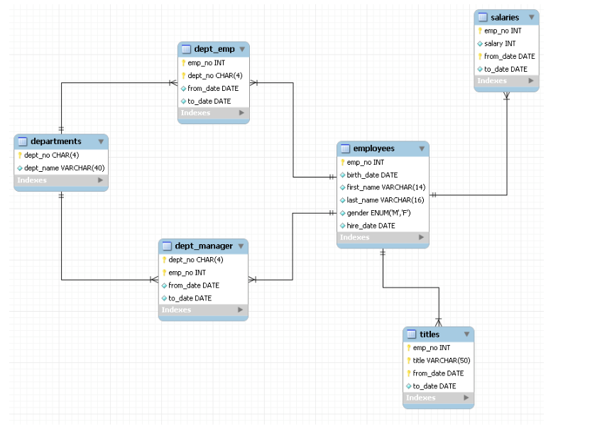

MySql中各种数据类型所占大小

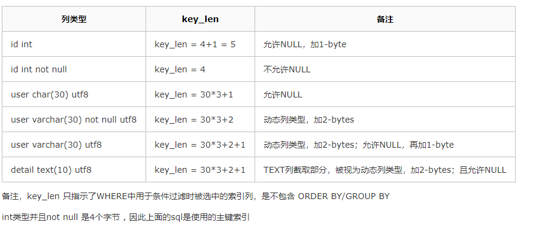

创建的testIndex索引内容

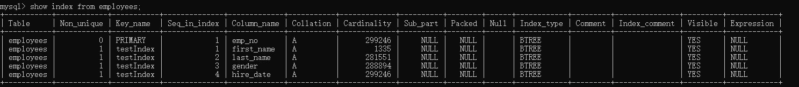

## or对索引使用的影响

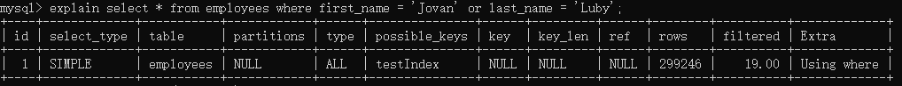

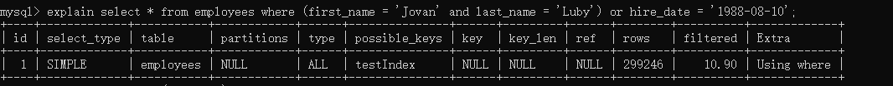

可以看出在组合索引中无法使用“or”进行索引查找

## in对索引使用的影响

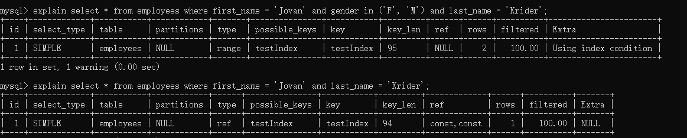

可以看出可以使用“in”对组合索引的使用没有影响

## like对索引使用的影响

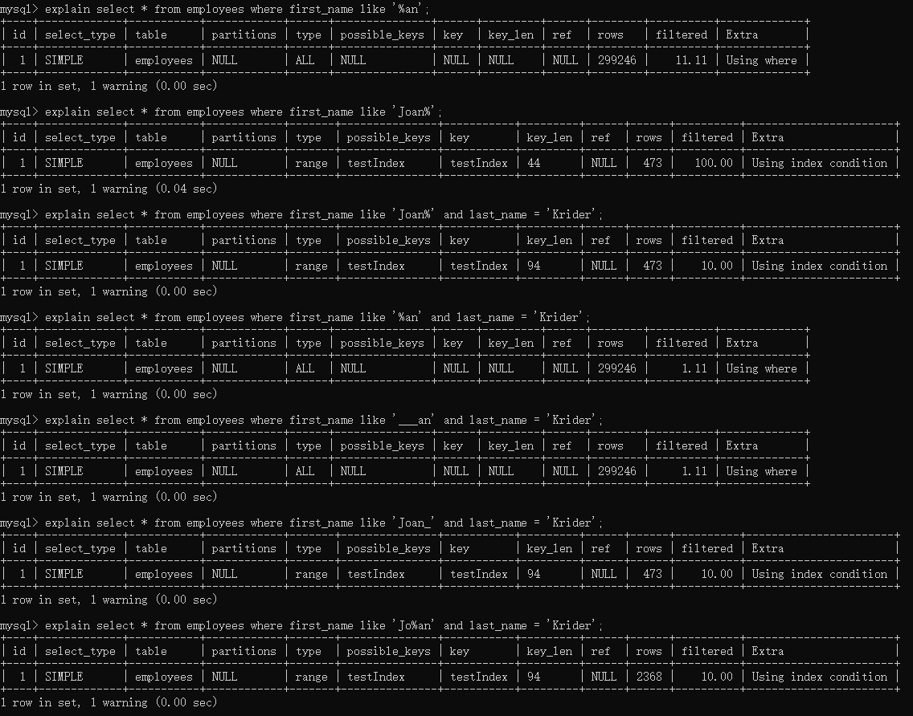

可以看到like 通配符放到最前面时才会使索引失效， 放到其他位置索引可以正常使用；

## 范围查询对索引的影响

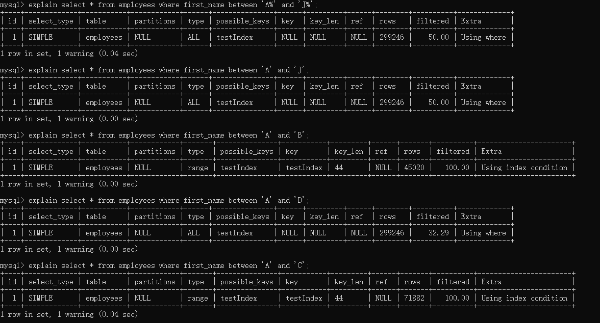

首先如果在查询的范围内可以筛选到的数据量比较大放弃使用索引；

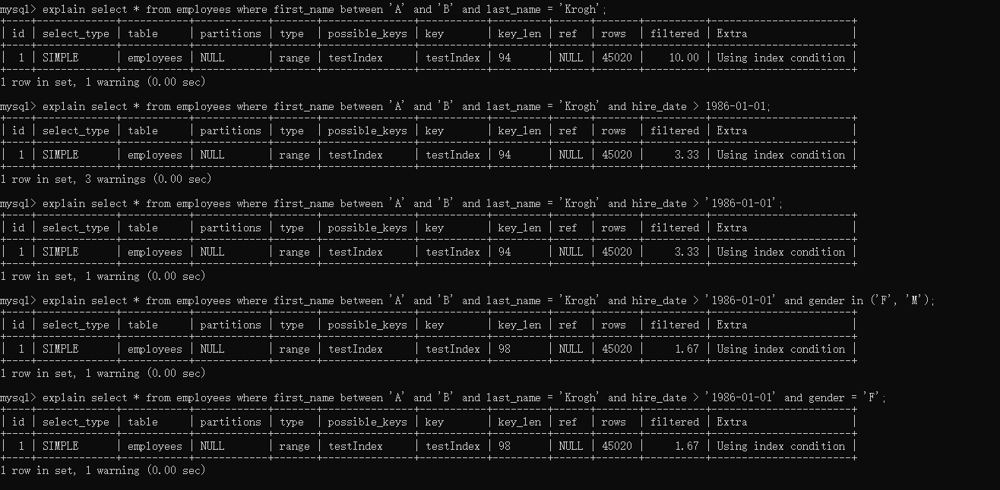

可以看出范围查询后的索引并没有失效；