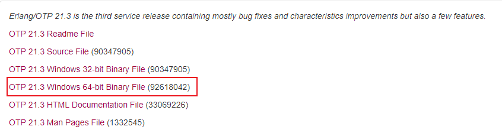
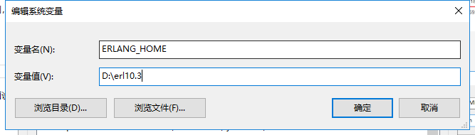
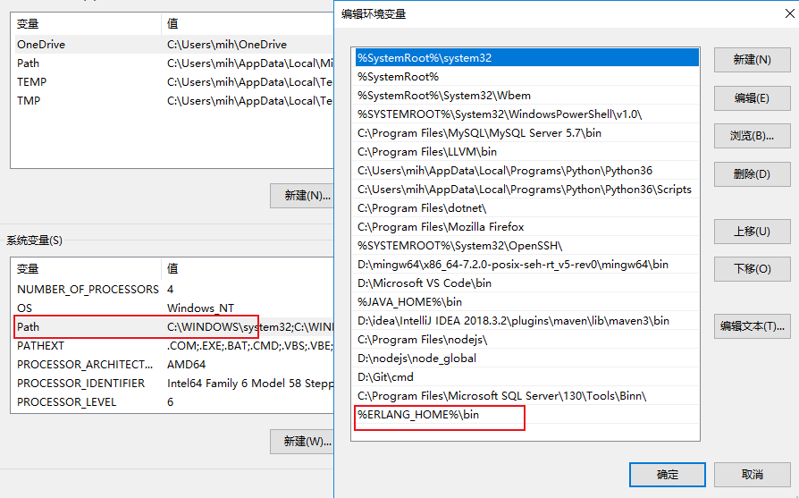
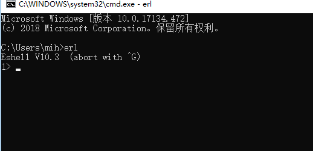
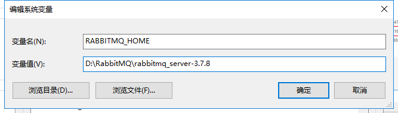
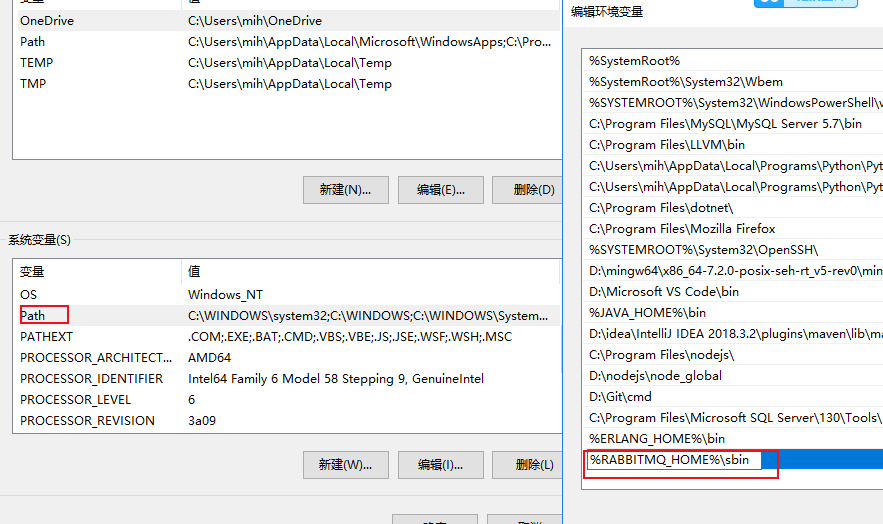
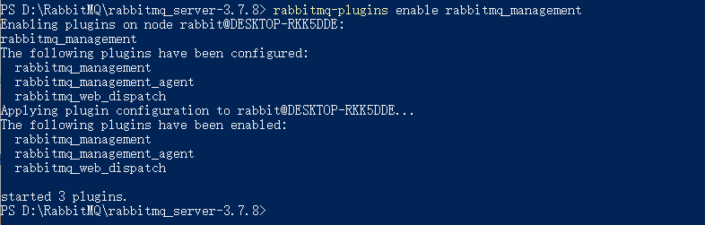

# RabbitMQ安装

https://www.rabbitmq.com/

## 安装Erlang

1. 下载安装Erlang

http://www.erlang.org/downloads

2. 新建环境变量

3. 验证是否安装成功

## RabbitMQ安装

1. 设置环境变量

2. 安装RabbitMQ_Plugins

此时可以通过访问http://localhost:15672进行测试，默认的登陆账号为：guest，密码为：guest