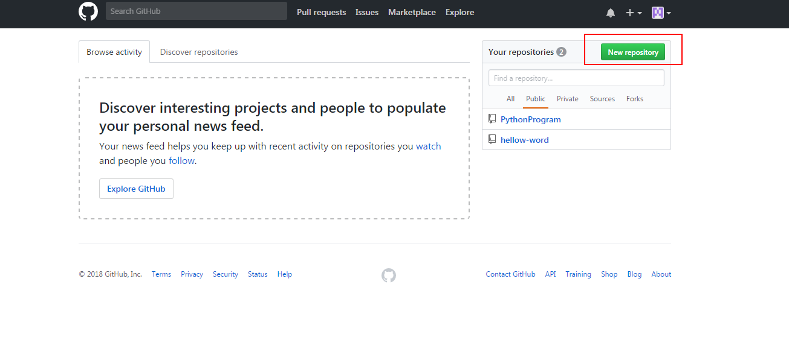
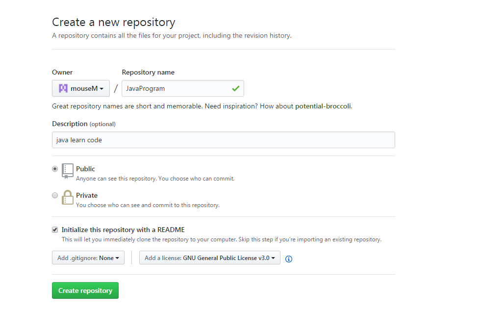
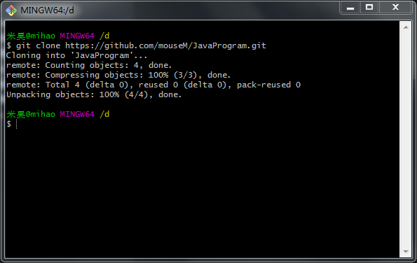
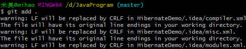
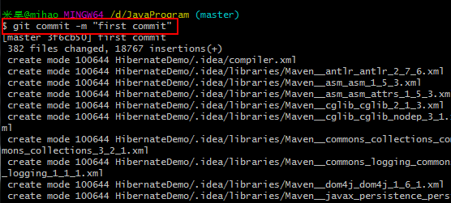
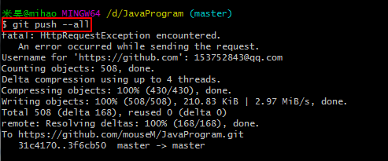

# windows环境下git上传代码

1. 在git上创建新的repository



2. 设置项目名称、项目描述与license



3. 将git创建的空白项目clone到本地



4. 将本地需要添加的文件复试到clone后的文件夹下


5. 将clone文件夹下的文件add添加到git索引下



6. git commit -m “提交信息”



7. git push --all



8. 如果是第一次上传需要全局配置git的用户名与密码

````
git config --global user.name "username"

git config --global user.email "email"
````

