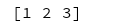

# Numpy常用函数

1. arange

    生成一个数组， 函数原型：array(p_object, dtype=None, copy=True, order='K', subok=False, ndmin=0)
    其中dtype表示返回的数组中元素是什么类型（尽量不要乱设这个值）

```(python)
    array = np.array([1, 2, 3])
```



2. reshape

3. zeros

4. zeros_like

5. ones

6. ones_like

7. empty

    生成一个3 * 2的数组， 数值随机

```(python)
    empty_array = np.empty(shape=(3, 2))
```

8. empty_like

    函数原型：empty_like(a, dtype=None, order='K', subok=True)， 生成一个和a shape相同的空的多维数组

```(python)
    ones_array = np.ones(shape=(3, 4))
    empty_array = np.empty_like(ones_array)
```

```(python)

```

9. linspace

10. fromfunction

    函数原型fromfunction(functijon, shape, dtype)

11. ravel

    将数组化成1 * n的新数组

12. transpose

13. resize

14. vstack

    vstack(a, b) 将a, b 两个数组的第一个维度合并，  假设a 是 a * b * c, b是 a * b * c, 结果是2a * b * c

15. hstack

    hstack(a, b) 将a, b 两个数组的最后一个维度合并, 假设a 是 a * b * c, b是 a * b * c, 结果是a * b * 2c

